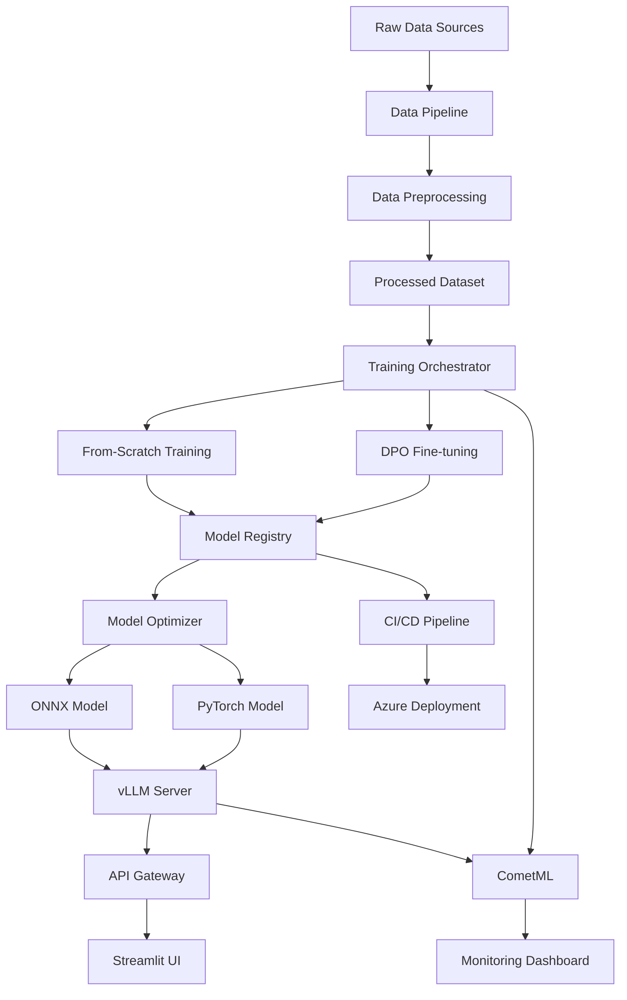

# Custom LLM Training and Serving System Architecture

## System Overview
**Purpose**: A production-ready system for training, fine-tuning, and serving custom LLM models with comprehensive monitoring, CI/CD, and cloud deployment capabilities.

## Components

| Layer | Component | Technology | Responsibility |
|-------|-----------|------------|----------------|
| **Data Layer** | Data Storage | Azure Blob Storage / S3 | Raw datasets, processed data, model artifacts |
| | Data Pipeline | Apache Airflow | ETL orchestration, data validation |
| | Data Preprocessing | Pandas, Datasets library | Text cleaning, tokenization, format conversion |
| **Training Layer** | Training Orchestrator | MLflow + Ray | Distributed training coordination |
| | Model Training | PyTorch + Transformers | From-scratch and DPO training |
| | Experiment Tracking | CometML | Training metrics, hyperparameters |
| | Model Registry | MLflow Model Registry | Version control, model artifacts |
| **Serving Layer** | Model Server | vLLM | High-throughput inference |
| | API Gateway | FastAPI + Nginx | Request routing, load balancing |
| | Model Optimizer | ONNX Runtime | Model optimization for deployment |
| **Application Layer** | Web Interface | Streamlit | User interaction, chat interface |
| | Authentication | Azure AD / OAuth2 | User management, API security |
| **Infrastructure** | Container Platform | Docker + Kubernetes | Containerization, orchestration |
| | Cloud Platform | Azure | Compute, storage, networking |
| | Monitoring | Prometheus + Grafana | System metrics, alerting |
| | CI/CD | Azure DevOps / GitHub Actions | Automated deployment pipeline |
| **Monitoring** | Real-time Monitoring | CometML + Custom Dashboard | Model performance, drift detection |
| | Logging | ELK Stack | Centralized logging, debugging |

## Data Flow

## Detailed Architecture

### 1. Data Pipeline
- **Input Sources**: Reports, documents, chat data, custom datasets
- **Processing**: Text extraction, cleaning, tokenization, format standardization
- **Storage**: Azure Blob Storage with versioning
- **Validation**: Data quality checks, schema validation

### 2. Training System
- **Hardware Support**: CUDA GPU acceleration with CPU fallback
- **Training Types**:
  - From-scratch training with Qwen-3 base architecture
  - DPO (Direct Preference Optimization) fine-tuning
- **Distributed Training**: Ray for multi-GPU/multi-node training
- **Experiment Tracking**: CometML for metrics, hyperparameters, artifacts

### 3. Model Serving
- **High-Throughput Server**: vLLM for optimized inference
- **Model Formats**: PyTorch native and ONNX optimized
- **Load Balancing**: Multiple model instances with auto-scaling
- **Caching**: Redis for response caching

### 4. Monitoring & Observability
- **Training Monitoring**: CometML for experiment tracking
- **Serving Monitoring**: Real-time latency, throughput, error rates
- **Model Monitoring**: Drift detection, performance degradation
- **Infrastructure Monitoring**: Prometheus + Grafana

### 5. CI/CD Pipeline
- **Code Quality**: Automated testing, linting
- **Model Validation**: Automated model evaluation
- **Deployment**: Blue-green deployment with rollback capability
- **Infrastructure as Code**: Terraform for Azure resources

## Technology Stack

### Core ML Stack
- **Framework**: PyTorch + Transformers
- **Model**: Qwen-3 (configurable)
- **Training**: DPO, LoRA, full fine-tuning
- **Optimization**: ONNX Runtime, TensorRT

### Infrastructure
- **Cloud**: Azure (VM Scale Sets, AKS, Blob Storage)
- **Containers**: Docker + Kubernetes
- **Orchestration**: Apache Airflow
- **Monitoring**: CometML, Prometheus, Grafana

### Development
- **API**: FastAPI
- **UI**: Streamlit
- **CI/CD**: Azure DevOps / GitHub Actions
- **IaC**: Terraform

## Security Considerations
- **Authentication**: OAuth2 with Azure AD integration
- **API Security**: Rate limiting, API keys, HTTPS
- **Data Encryption**: At rest and in transit
- **Model Security**: Model artifact signing and verification
- **Network Security**: VPC, security groups, WAF

## Scalability Features
- **Auto-scaling**: Kubernetes HPA for serving pods
- **Load Balancing**: Application Gateway with health checks
- **Caching**: Multi-level caching (Redis, CDN)
- **Database**: Distributed storage with replication
- **Compute**: Spot instances for cost optimization

## Recovery & Reliability
- **Backup Strategy**: 
  - Model artifacts: Daily backups to Azure Blob Storage
  - Data: Cross-region replication
  - RTO: 15 minutes for serving, 4 hours for training
- **Disaster Recovery**: Multi-region deployment capability
- **Health Checks**: Comprehensive monitoring with automated failover
- **Data Consistency**: Event sourcing for training pipeline

## Configuration Management
- **Model Selection**: Environment-based configuration
- **Hyperparameters**: Centralized configuration management
- **Feature Flags**: Runtime model switching capability
- **Environment Isolation**: Dev/Staging/Production separation

## Performance Optimization
- **Model Optimization**: Quantization, pruning, distillation
- **Serving Optimization**: Batching, caching, model parallelism
- **Data Pipeline**: Parallel processing, incremental updates
- **Resource Management**: GPU memory optimization, CPU utilization

## Compliance & Governance
- **Model Versioning**: Semantic versioning with lineage tracking
- **Audit Logging**: Complete audit trail for all operations
- **Data Governance**: Data lineage, privacy controls
- **Model Governance**: Approval workflows, performance gates

---

## Validation Checklist

✅ **No ambiguous connections**: All component interactions are explicitly defined with protocols and data formats

✅ **End-to-end user paths**: 
- Data ingestion → preprocessing → training → serving → UI
- Model switching and configuration updates
- Monitoring and alerting workflows

✅ **Failure handling**: 
- Training failures: Checkpointing and resume capability
- Serving failures: Load balancer failover and circuit breakers
- Data pipeline failures: Retry mechanisms and dead letter queues
- Infrastructure failures: Auto-scaling and disaster recovery procedures