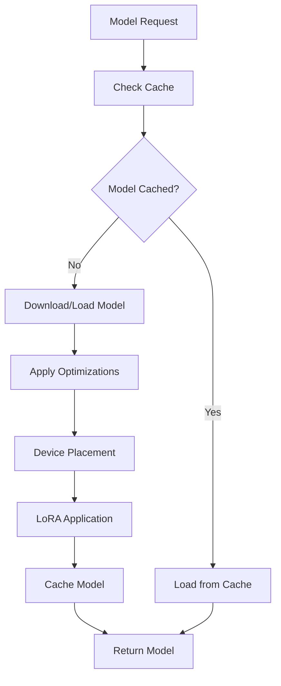

# Core Components Documentation

The core components form the foundation of the Custom LLM Chatbot system, providing essential services for configuration management, model handling, and system coordination.

## 📁 Component Overview

| Component | File | Purpose |
|-----------|------|----------|
| **Configuration Manager** | `config.py` | Centralized configuration management with validation |
| **Model Manager** | `model_manager.py` | Model loading, optimization, and lifecycle management |

## 🔧 Configuration Management

### Overview
The configuration system provides type-safe, hierarchical configuration management using Python dataclasses and YAML files. It supports validation, environment variable overrides, and runtime updates.

### Key Features
- **Type Safety**: Dataclass-based configuration with automatic validation
- **Hierarchical Structure**: Nested configuration sections for different components
- **Environment Overrides**: Support for environment variable configuration
- **Validation**: Comprehensive configuration validation with error reporting
- **Hot Reloading**: Runtime configuration updates without restart

### Configuration Structure

```yaml
# config.yaml
model:
  name: "Qwen/Qwen2.5-3B"
  model_type: "qwen"
  max_length: 2048
  device: "auto"
  torch_dtype: "auto"
  trust_remote_code: true

training:
  training_type: "dpo"  # from_scratch, dpo, sft, lora
  output_dir: "./models/trained"
  logging_dir: "./logs"
  seed: 42
  
  # Training method specific configs
  from_scratch:
    num_train_epochs: 3
    per_device_train_batch_size: 4
    learning_rate: 5e-5
    
  dpo:
    num_train_epochs: 1
    per_device_train_batch_size: 2
    learning_rate: 1e-6
    beta: 0.1
    
  lora:
    enabled: true
    r: 16
    lora_alpha: 32
    lora_dropout: 0.1
    target_modules: ["q_proj", "v_proj", "k_proj", "o_proj"]

data:
  train_data_path: "./data/train"
  eval_data_path: "./data/eval"
  max_length: 2048
  batch_size: 1000
  
serving:
  backend_type: "pytorch"  # pytorch, onnx, vllm
  host: "0.0.0.0"
  port: 8000
  max_concurrent_requests: 100
  
monitoring:
  wandb:
    enabled: false
    project: "custom-llm-chatbot"
  comet:
    enabled: false
    project_name: "custom-llm-chatbot"
  mlflow:
    enabled: true
    tracking_uri: "./mlruns"
```

### Configuration Classes

#### ModelConfig
Manages model-specific configuration:

```python
@dataclass
class ModelConfig:
    name: str = "Qwen/Qwen2.5-3B"
    model_type: str = "qwen"
    max_length: int = 2048
    device: str = "auto"
    torch_dtype: str = "auto"
    trust_remote_code: bool = True
```

**Key Parameters**:
- `name`: HuggingFace model name or local path
- `model_type`: Model architecture type (qwen, llama, etc.)
- `max_length`: Maximum sequence length
- `device`: Target device (auto, cpu, cuda, cuda:0, etc.)
- `torch_dtype`: PyTorch data type (auto, float16, bfloat16, float32)
- `trust_remote_code`: Allow remote code execution for custom models

#### TrainingConfig
Manages training-specific configuration:

```python
@dataclass
class TrainingConfig:
    output_dir: str = "./models/trained"
    logging_dir: str = "./logs"
    seed: int = 42
    training_type: str = "dpo"
    
    # Sub-configurations
    from_scratch: FromScratchConfig = field(default_factory=FromScratchConfig)
    dpo: DPOConfig = field(default_factory=DPOConfig)
    lora: LoRAConfig = field(default_factory=LoRAConfig)
```

**Training Types**:
- `from_scratch`: Complete model training from initialization
- `dpo`: Direct Preference Optimization
- `sft`: Supervised Fine-Tuning
- `lora`: Low-Rank Adaptation fine-tuning

#### DataConfig
Manages data processing configuration:

```python
@dataclass
class DataConfig:
    train_data_path: str = "./data/train"
    eval_data_path: str = "./data/eval"
    test_data_path: str = "./data/test"
    data_types: list = field(default_factory=lambda: ["chat", "documents", "reports"])
    max_length: int = 2048
    batch_size: int = 1000
```

### Usage Examples

#### Basic Configuration Loading
```python
from src.core.config import ConfigManager

# Initialize configuration manager
config = ConfigManager()

# Load configuration from file
config.load_config("config.yaml")

# Access configuration values
model_name = config.model.name
training_type = config.training.training_type
batch_size = config.data.batch_size

# Validate configuration
is_valid = config.validate_config()
if not is_valid:
    print("Configuration validation failed")
```

#### Environment Variable Overrides
```bash
# Override configuration with environment variables
export MODEL_NAME="microsoft/DialoGPT-medium"
export TRAINING_TYPE="sft"
export BATCH_SIZE="8"
```

```python
# Configuration will automatically use environment variables
config = ConfigManager()
config.load_config("config.yaml")
# model.name will be "microsoft/DialoGPT-medium"
```

#### Runtime Configuration Updates
```python
# Update configuration at runtime
config.update_model_name("new-model-name")
config.update_training_type("lora")
config.update_batch_size(16)

# Save updated configuration
config.save_config("updated_config.yaml")
```

## 🤖 Model Management

### Overview
The Model Manager handles all aspects of model lifecycle including loading, optimization, device management, and format conversion.

### Key Features
- **Multi-Format Support**: PyTorch, ONNX, and quantized models
- **Device Management**: Automatic device selection and multi-GPU support
- **Memory Optimization**: Efficient memory usage and optimization techniques
- **LoRA Integration**: Parameter-efficient fine-tuning support
- **Lazy Loading**: Load models only when needed

### Model Loading Process



### Usage Examples

#### Basic Model Loading
```python
from src.core.config import ConfigManager
from src.core.model_manager import ModelManager

# Initialize components
config = ConfigManager()
model_manager = ModelManager(config)

# Load model
success = model_manager.load_model()
if success:
    print("Model loaded successfully")
    print(f"Device: {model_manager.device}")
    print(f"Model type: {model_manager.model.__class__.__name__}")
else:
    print("Failed to load model")
```

#### Model with LoRA
```python
# Enable LoRA in configuration
config.training.lora.enabled = True
config.training.lora.r = 16
config.training.lora.target_modules = ["q_proj", "v_proj"]

# Load model with LoRA
model_manager = ModelManager(config)
model_manager.load_model()

# Check if LoRA is applied
if model_manager.is_peft_model:
    print("LoRA successfully applied")
    print(f"Trainable parameters: {model_manager.get_trainable_parameters()}")
```

#### Model Optimization
```python
# Optimize model for inference
optimized_model = model_manager.optimize_for_inference(
    optimization_level="O2",  # O1, O2, O3
    use_fp16=True,
    use_quantization=True
)

# Convert to ONNX
onnx_path = model_manager.convert_to_onnx(
    output_path="./models/model.onnx",
    input_shape=(1, 512),
    dynamic_axes=True
)
```

#### Multi-GPU Setup
```python
# Configure for multi-GPU
config.model.device = "auto"  # Automatic device selection

# Load model with distributed setup
model_manager = ModelManager(config)
model_manager.setup_distributed_training()
model_manager.load_model()

# Check GPU allocation
gpu_info = model_manager.get_gpu_info()
print(f"Using {gpu_info['num_gpus']} GPUs")
print(f"Memory usage: {gpu_info['memory_usage']}")
```

### Model Formats and Optimization

#### Supported Model Formats
1. **PyTorch Native** (`.pt`, `.pth`)
   - Full feature support
   - Easy debugging and development
   - Direct gradient computation

2. **ONNX Runtime** (`.onnx`)
   - Cross-platform compatibility
   - Optimized inference performance
   - Reduced memory footprint

3. **Quantized Models**
   - 8-bit and 4-bit quantization
   - Significant memory reduction
   - Maintained accuracy

#### Optimization Techniques

1. **Memory Optimization**
   ```python
   # Enable memory optimizations
   model_manager.enable_memory_optimization(
       gradient_checkpointing=True,
       cpu_offload=True,
       pin_memory=True
   )
   ```

2. **Quantization**
   ```python
   # Apply quantization
   quantized_model = model_manager.quantize_model(
       quantization_type="dynamic",  # dynamic, static, qat
       dtype="int8"  # int8, int4
   )
   ```

3. **Compilation**
   ```python
   # Compile model for faster inference
   compiled_model = model_manager.compile_model(
       backend="inductor",  # inductor, aot_eager
       mode="reduce-overhead"  # default, reduce-overhead, max-autotune
   )
   ```

### Error Handling and Recovery

#### Common Error Scenarios
1. **Out of Memory (OOM)**
   - Automatic fallback to CPU
   - Memory optimization suggestions
   - Batch size reduction

2. **Model Loading Failures**
   - Network connectivity issues
   - Corrupted model files
   - Incompatible model formats

3. **Device Compatibility**
   - CUDA version mismatches
   - Insufficient GPU memory
   - Driver compatibility issues

#### Error Handling Example
```python
try:
    model_manager.load_model()
except ModelLoadError as e:
    if e.error_type == "OOM":
        # Try with reduced precision
        config.model.torch_dtype = "float16"
        model_manager.load_model()
    elif e.error_type == "DEVICE_ERROR":
        # Fallback to CPU
        config.model.device = "cpu"
        model_manager.load_model()
    else:
        logger.error(f"Model loading failed: {e}")
        raise
```

## 🔧 Advanced Configuration

### Custom Configuration Classes

You can extend the configuration system with custom classes:

```python
from dataclasses import dataclass, field
from src.core.config import ConfigManager

@dataclass
class CustomConfig:
    custom_parameter: str = "default_value"
    custom_list: list = field(default_factory=list)
    custom_dict: dict = field(default_factory=dict)

# Extend ConfigManager
class ExtendedConfigManager(ConfigManager):
    def __init__(self):
        super().__init__()
        self.custom = CustomConfig()
    
    def load_custom_config(self, config_dict: dict):
        if "custom" in config_dict:
            custom_data = config_dict["custom"]
            self.custom = CustomConfig(**custom_data)
```

### Configuration Validation

```python
def validate_custom_config(config: ConfigManager) -> bool:
    """Custom validation logic."""
    errors = []
    
    # Validate model configuration
    if not config.model.name:
        errors.append("Model name cannot be empty")
    
    # Validate training configuration
    if config.training.from_scratch.learning_rate <= 0:
        errors.append("Learning rate must be positive")
    
    # Validate data configuration
    if not Path(config.data.train_data_path).exists():
        errors.append(f"Training data path does not exist: {config.data.train_data_path}")
    
    if errors:
        for error in errors:
            logger.error(f"Configuration validation error: {error}")
        return False
    
    return True
```

## 📊 Performance Monitoring

The core components include built-in performance monitoring:

### Model Loading Metrics
- Model loading time
- Memory usage before/after loading
- Device utilization
- Optimization application time

### Configuration Metrics
- Configuration loading time
- Validation time
- Update frequency
- Error rates

### Monitoring Example
```python
# Enable performance monitoring
config.monitoring.enabled = True
config.monitoring.log_level = "INFO"

# Model manager will automatically log metrics
model_manager = ModelManager(config)
with model_manager.performance_monitor():
    model_manager.load_model()

# Access performance metrics
metrics = model_manager.get_performance_metrics()
print(f"Loading time: {metrics['loading_time']:.2f}s")
print(f"Memory usage: {metrics['memory_usage']:.2f}MB")
```

This comprehensive core system provides the foundation for all other components in the Custom LLM Chatbot framework, ensuring reliable, efficient, and scalable operation.