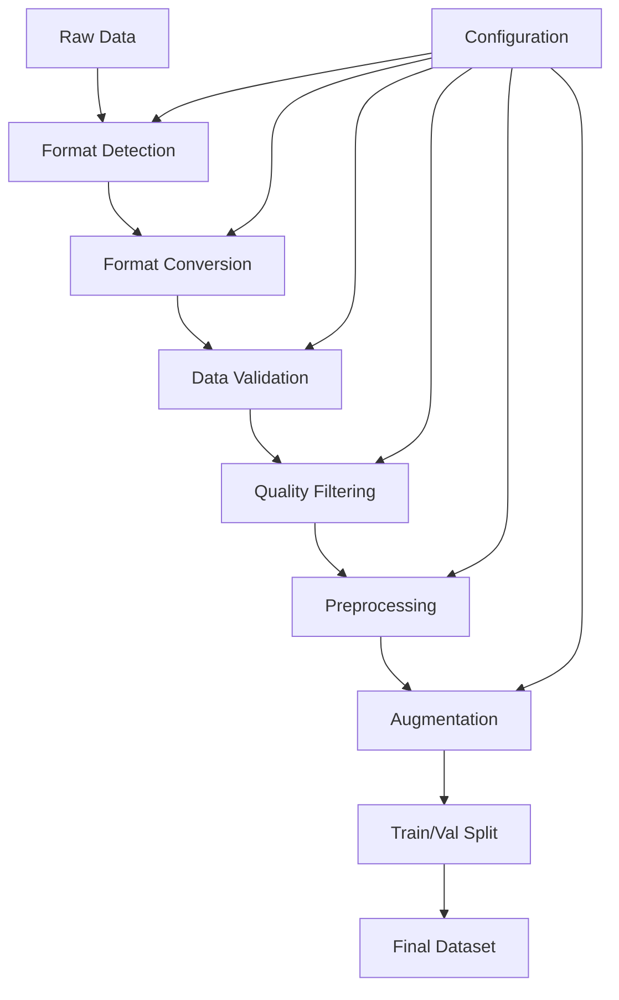

# Data Processing Guide

Comprehensive guide for preparing, processing, and managing data for training custom language models.

## 📋 Table of Contents

- [Overview](#overview)
- [Data Formats](#data-formats)
- [Data Processing Pipeline](#data-processing-pipeline)
- [Data Validation](#data-validation)
- [Data Preprocessing](#data-preprocessing)
- [Data Augmentation](#data-augmentation)
- [Quality Control](#quality-control)
- [Performance Optimization](#performance-optimization)
- [Best Practices](#best-practices)
- [Troubleshooting](#troubleshooting)

## 🔍 Overview

The data processing system provides a robust pipeline for preparing training data for different types of language model training:

- **Chat/Conversation Data**: Multi-turn dialogues
- **Instruction Data**: Task-specific instructions with inputs/outputs
- **DPO Data**: Preference pairs for Direct Preference Optimization
- **Document Data**: Long-form text for pre-training
- **Code Data**: Programming code and documentation

### Key Features

- **Format Standardization**: Convert various formats to unified structure
- **Quality Filtering**: Remove low-quality or problematic samples
- **Data Validation**: Ensure data integrity and format compliance
- **Preprocessing**: Tokenization, truncation, and padding
- **Augmentation**: Generate additional training samples
- **Streaming**: Handle large datasets efficiently
- **Caching**: Speed up repeated processing

## 📊 Data Formats

### Chat/Conversation Format

For multi-turn conversations and chat-based training:

```json
{
  "messages": [
    {
      "role": "system",
      "content": "You are a helpful assistant."
    },
    {
      "role": "user",
      "content": "What is machine learning?"
    },
    {
      "role": "assistant",
      "content": "Machine learning is a subset of artificial intelligence..."
    }
  ],
  "metadata": {
    "conversation_id": "conv_001",
    "timestamp": "2024-01-15T10:30:00Z",
    "language": "en",
    "quality_score": 0.95
  }
}
```

**Supported Roles**:
- `system`: System prompts and instructions
- `user`: User messages and queries
- `assistant`: AI assistant responses
- `function`: Function call results (for tool use)

### Instruction Format

For supervised fine-tuning with instruction-following:

```json
{
  "instruction": "Translate the following English text to French:",
  "input": "Hello, how are you today?",
  "output": "Bonjour, comment allez-vous aujourd'hui?",
  "metadata": {
    "task_type": "translation",
    "difficulty": "easy",
    "source": "manual",
    "quality_score": 1.0
  }
}
```

**Alternative Format**:
```json
{
  "prompt": "Translate to French: Hello, how are you today?",
  "completion": "Bonjour, comment allez-vous aujourd'hui?",
  "metadata": {
    "task_type": "translation"
  }
}
```

### DPO (Direct Preference Optimization) Format

For preference-based training:

```json
{
  "prompt": "What is the capital of France?",
  "chosen": "The capital of France is Paris, which is located in the north-central part of the country.",
  "rejected": "I think it might be Lyon or maybe Marseille, but I'm not completely sure.",
  "metadata": {
    "preference_strength": 0.9,
    "annotator_id": "annotator_001",
    "task_category": "factual_qa"
  }
}
```

### Document Format

For pre-training or document-based fine-tuning:

```json
{
  "text": "Long document content here...",
  "title": "Document Title",
  "metadata": {
    "source": "wikipedia",
    "url": "https://example.com/article",
    "word_count": 1500,
    "language": "en",
    "topic": "science"
  }
}
```

### Code Format

For code generation and programming tasks:

```json
{
  "instruction": "Write a Python function to calculate factorial",
  "input": "def factorial(n):",
  "output": "def factorial(n):\n    if n <= 1:\n        return 1\n    return n * factorial(n - 1)",
  "metadata": {
    "language": "python",
    "complexity": "beginner",
    "test_cases": [
      {"input": 5, "expected": 120},
      {"input": 0, "expected": 1}
    ]
  }
}
```

## 🔄 Data Processing Pipeline

### Pipeline Architecture



### Processing Steps

#### 1. Data Ingestion

```python
# Process data from various sources
from src.data.processor import DataProcessor

processor = DataProcessor(config_path="config/data_processing.yaml")

# Process single file
dataset = processor.process_file(
    input_path="./raw_data/conversations.jsonl",
    output_path="./data/processed/train.jsonl",
    format_type="chat"
)

# Process directory
dataset = processor.process_directory(
    input_dir="./raw_data",
    output_dir="./data/processed",
    format_type="auto"  # Auto-detect format
)
```

#### 2. Format Conversion

```python
# Convert between formats
from src.data.converters import FormatConverter

converter = FormatConverter()

# Convert instruction to chat format
chat_data = converter.instruction_to_chat(
    instruction_data,
    system_prompt="You are a helpful assistant."
)

# Convert chat to instruction format
instruction_data = converter.chat_to_instruction(
    chat_data,
    template="{instruction}\n\nInput: {input}\n\nOutput: {output}"
)
```

#### 3. Data Validation

```python
# Validate data format and quality
from src.data.validator import DataValidator

validator = DataValidator()

# Validate single sample
is_valid, errors = validator.validate_sample(sample, format_type="chat")

# Validate entire dataset
validation_report = validator.validate_dataset(
    dataset_path="./data/train.jsonl",
    format_type="chat"
)

print(f"Valid samples: {validation_report.valid_count}")
print(f"Invalid samples: {validation_report.invalid_count}")
print(f"Errors: {validation_report.errors}")
```

### Configuration Example

```yaml
# config/data_processing.yaml
data_processing:
  # Input settings
  input:
    formats: ["jsonl", "json", "csv", "txt"]
    encoding: "utf-8"
    max_file_size: "1GB"
    
  # Output settings
  output:
    format: "jsonl"
    compression: "gzip"
    chunk_size: 10000
    
  # Validation settings
  validation:
    enabled: true
    strict_mode: false
    max_errors: 100
    
  # Quality filtering
  quality:
    min_length: 10
    max_length: 4096
    min_quality_score: 0.5
    remove_duplicates: true
    
  # Preprocessing
  preprocessing:
    tokenizer: "Qwen/Qwen2.5-3B"
    max_tokens: 2048
    truncation: true
    padding: false
    
  # Augmentation
  augmentation:
    enabled: false
    methods: ["paraphrase", "backtranslation"]
    augmentation_ratio: 0.2
    
  # Splitting
  splitting:
    train_ratio: 0.8
    val_ratio: 0.1
    test_ratio: 0.1
    stratify: true
    seed: 42
```

## ✅ Data Validation

### Validation Rules

#### Chat Format Validation

```python
class ChatValidator:
    def validate(self, sample):
        errors = []
        
        # Check required fields
        if "messages" not in sample:
            errors.append("Missing 'messages' field")
            return False, errors
            
        messages = sample["messages"]
        
        # Check message structure
        for i, msg in enumerate(messages):
            if "role" not in msg:
                errors.append(f"Message {i}: Missing 'role' field")
            if "content" not in msg:
                errors.append(f"Message {i}: Missing 'content' field")
                
            # Validate role
            if msg.get("role") not in ["system", "user", "assistant", "function"]:
                errors.append(f"Message {i}: Invalid role '{msg.get('role')}'")
                
            # Validate content
            content = msg.get("content", "")
            if not isinstance(content, str) or len(content.strip()) == 0:
                errors.append(f"Message {i}: Empty or invalid content")
                
        return len(errors) == 0, errors
```

#### Instruction Format Validation

```python
class InstructionValidator:
    def validate(self, sample):
        errors = []
        
        # Check required fields
        required_fields = ["instruction", "output"]
        for field in required_fields:
            if field not in sample:
                errors.append(f"Missing required field: {field}")
                
        # Validate field types and content
        for field in ["instruction", "input", "output"]:
            if field in sample:
                value = sample[field]
                if not isinstance(value, str):
                    errors.append(f"Field '{field}' must be string")
                elif len(value.strip()) == 0:
                    errors.append(f"Field '{field}' cannot be empty")
                    
        return len(errors) == 0, errors
```

### Validation Reports

```python
# Generate comprehensive validation report
from src.data.validator import DataValidator

validator = DataValidator()
report = validator.generate_report("./data/train.jsonl")

print(f"""
Validation Report
================
Total samples: {report.total_samples}
Valid samples: {report.valid_samples}
Invalid samples: {report.invalid_samples}
Validation rate: {report.validation_rate:.2%}

Error Summary:
{report.error_summary}

Quality Metrics:
- Average length: {report.avg_length:.1f} tokens
- Length distribution: {report.length_distribution}
- Language distribution: {report.language_distribution}
""")
```

## 🔧 Data Preprocessing

### Tokenization

```python
from src.data.preprocessor import DataPreprocessor
from transformers import AutoTokenizer

# Initialize preprocessor
tokenizer = AutoTokenizer.from_pretrained("Qwen/Qwen2.5-3B")
preprocessor = DataPreprocessor(tokenizer=tokenizer)

# Preprocess chat data
processed_data = preprocessor.preprocess_chat(
    data=chat_data,
    max_length=2048,
    truncation=True,
    padding=False
)

# Preprocess instruction data
processed_data = preprocessor.preprocess_instruction(
    data=instruction_data,
    template="{instruction}\n\n{input}\n\n{output}",
    max_length=2048
)
```

### Text Cleaning

```python
class TextCleaner:
    def __init__(self):
        self.patterns = {
            'urls': r'http[s]?://(?:[a-zA-Z]|[0-9]|[$-_@.&+]|[!*\(\),]|(?:%[0-9a-fA-F][0-9a-fA-F]))+',
            'emails': r'\b[A-Za-z0-9._%+-]+@[A-Za-z0-9.-]+\.[A-Z|a-z]{2,}\b',
            'phone_numbers': r'\b\d{3}[-.]?\d{3}[-.]?\d{4}\b',
            'extra_whitespace': r'\s+',
            'special_chars': r'[^\w\s.,!?;:()\[\]{}"\'-]'
        }
    
    def clean_text(self, text, remove_patterns=None):
        if remove_patterns is None:
            remove_patterns = ['urls', 'emails', 'extra_whitespace']
            
        cleaned = text
        for pattern_name in remove_patterns:
            if pattern_name in self.patterns:
                if pattern_name == 'extra_whitespace':
                    cleaned = re.sub(self.patterns[pattern_name], ' ', cleaned)
                else:
                    cleaned = re.sub(self.patterns[pattern_name], '', cleaned)
                    
        return cleaned.strip()
```

### Data Filtering

```python
class QualityFilter:
    def __init__(self, config):
        self.min_length = config.get('min_length', 10)
        self.max_length = config.get('max_length', 4096)
        self.min_quality_score = config.get('min_quality_score', 0.5)
        self.language_filter = config.get('language_filter', ['en'])
        
    def filter_sample(self, sample):
        # Length filtering
        text = self.extract_text(sample)
        if len(text) < self.min_length or len(text) > self.max_length:
            return False, "Length out of range"
            
        # Quality score filtering
        quality_score = self.calculate_quality_score(text)
        if quality_score < self.min_quality_score:
            return False, f"Quality score too low: {quality_score}"
            
        # Language filtering
        language = self.detect_language(text)
        if language not in self.language_filter:
            return False, f"Language not supported: {language}"
            
        return True, "Passed all filters"
        
    def calculate_quality_score(self, text):
        # Simple quality scoring based on various factors
        score = 1.0
        
        # Penalize excessive repetition
        words = text.split()
        if len(words) > 0:
            unique_ratio = len(set(words)) / len(words)
            score *= unique_ratio
            
        # Penalize excessive punctuation
        punct_ratio = sum(1 for c in text if c in '.,!?;:') / len(text)
        if punct_ratio > 0.1:
            score *= (1 - punct_ratio)
            
        # Penalize excessive uppercase
        upper_ratio = sum(1 for c in text if c.isupper()) / len(text)
        if upper_ratio > 0.3:
            score *= (1 - upper_ratio)
            
        return max(0.0, min(1.0, score))
```

## 🔄 Data Augmentation

### Augmentation Techniques

#### 1. Paraphrasing

```python
from src.data.augmentation import ParaphraseAugmenter

augmenter = ParaphraseAugmenter(model_name="t5-base")

# Augment instruction data
original_sample = {
    "instruction": "Translate to French",
    "input": "Hello world",
    "output": "Bonjour le monde"
}

augmented_samples = augmenter.augment_instruction(
    original_sample,
    num_variations=3
)

# Results:
# [
#   {"instruction": "Convert to French", "input": "Hello world", "output": "Bonjour le monde"},
#   {"instruction": "Translate into French", "input": "Hello world", "output": "Bonjour le monde"},
#   {"instruction": "Render in French", "input": "Hello world", "output": "Bonjour le monde"}
# ]
```

#### 2. Back-Translation

```python
from src.data.augmentation import BackTranslationAugmenter

augmenter = BackTranslationAugmenter(
    source_lang="en",
    intermediate_langs=["fr", "de", "es"]
)

augmented_text = augmenter.augment_text(
    "Machine learning is a powerful technology."
)
# Result: "Machine learning is a potent technology." (after en->fr->en)
```

#### 3. Synonym Replacement

```python
from src.data.augmentation import SynonymAugmenter

augmenter = SynonymAugmenter(replacement_rate=0.1)

augmented_text = augmenter.augment_text(
    "The quick brown fox jumps over the lazy dog."
)
# Result: "The fast brown fox leaps over the lazy dog."
```

#### 4. Conversation Augmentation

```python
from src.data.augmentation import ConversationAugmenter

augmenter = ConversationAugmenter()

# Add context variations
original_conversation = {
    "messages": [
        {"role": "user", "content": "What's the weather like?"},
        {"role": "assistant", "content": "I don't have access to current weather data."}
    ]
}

augmented_conversations = augmenter.add_context_variations(
    original_conversation,
    contexts=["formal", "casual", "technical"]
)
```

### Augmentation Pipeline

```python
class AugmentationPipeline:
    def __init__(self, config):
        self.augmenters = []
        
        if config.get('paraphrase', {}).get('enabled', False):
            self.augmenters.append(
                ParaphraseAugmenter(**config['paraphrase'])
            )
            
        if config.get('backtranslation', {}).get('enabled', False):
            self.augmenters.append(
                BackTranslationAugmenter(**config['backtranslation'])
            )
            
        if config.get('synonym', {}).get('enabled', False):
            self.augmenters.append(
                SynonymAugmenter(**config['synonym'])
            )
    
    def augment_dataset(self, dataset, augmentation_ratio=0.2):
        augmented_samples = []
        
        for sample in dataset:
            # Keep original
            augmented_samples.append(sample)
            
            # Generate augmented versions
            if random.random() < augmentation_ratio:
                for augmenter in self.augmenters:
                    try:
                        aug_sample = augmenter.augment(sample)
                        augmented_samples.append(aug_sample)
                    except Exception as e:
                        print(f"Augmentation failed: {e}")
                        
        return augmented_samples
```

## 🎯 Quality Control

### Quality Metrics

```python
class QualityAnalyzer:
    def analyze_dataset(self, dataset_path):
        metrics = {
            'total_samples': 0,
            'avg_length': 0,
            'length_distribution': {},
            'language_distribution': {},
            'quality_scores': [],
            'duplicate_rate': 0,
            'error_rate': 0
        }
        
        samples = self.load_dataset(dataset_path)
        metrics['total_samples'] = len(samples)
        
        lengths = []
        quality_scores = []
        languages = []
        texts = []
        
        for sample in samples:
            text = self.extract_text(sample)
            texts.append(text)
            
            # Length analysis
            length = len(text.split())
            lengths.append(length)
            
            # Quality analysis
            quality = self.calculate_quality_score(text)
            quality_scores.append(quality)
            
            # Language detection
            lang = self.detect_language(text)
            languages.append(lang)
        
        # Calculate metrics
        metrics['avg_length'] = np.mean(lengths)
        metrics['length_distribution'] = self.calculate_distribution(lengths)
        metrics['language_distribution'] = Counter(languages)
        metrics['quality_scores'] = {
            'mean': np.mean(quality_scores),
            'std': np.std(quality_scores),
            'min': np.min(quality_scores),
            'max': np.max(quality_scores)
        }
        
        # Duplicate detection
        unique_texts = set(texts)
        metrics['duplicate_rate'] = 1 - (len(unique_texts) / len(texts))
        
        return metrics
```

### Quality Improvement

```python
class QualityImprover:
    def improve_dataset(self, dataset, target_quality=0.8):
        improved_samples = []
        
        for sample in dataset:
            # Calculate current quality
            current_quality = self.calculate_quality_score(sample)
            
            if current_quality >= target_quality:
                improved_samples.append(sample)
            else:
                # Try to improve the sample
                improved_sample = self.improve_sample(sample)
                improved_quality = self.calculate_quality_score(improved_sample)
                
                if improved_quality >= target_quality:
                    improved_samples.append(improved_sample)
                # Otherwise, discard the sample
                
        return improved_samples
    
    def improve_sample(self, sample):
        # Apply various improvement techniques
        improved = sample.copy()
        
        # Fix common issues
        improved = self.fix_formatting(improved)
        improved = self.fix_grammar(improved)
        improved = self.remove_noise(improved)
        
        return improved
```

## ⚡ Performance Optimization

### Streaming Processing

```python
from src.data.streaming import StreamingProcessor

processor = StreamingProcessor(
    chunk_size=1000,
    num_workers=4,
    cache_size=10000
)

# Process large dataset in chunks
for chunk in processor.process_stream(
    input_path="large_dataset.jsonl",
    output_path="processed_dataset.jsonl"
):
    print(f"Processed chunk with {len(chunk)} samples")
```

### Parallel Processing

```python
from multiprocessing import Pool
from functools import partial

def process_chunk(chunk, processor_config):
    processor = DataProcessor(processor_config)
    return processor.process_samples(chunk)

def parallel_process_dataset(dataset, num_workers=4):
    # Split dataset into chunks
    chunk_size = len(dataset) // num_workers
    chunks = [dataset[i:i+chunk_size] for i in range(0, len(dataset), chunk_size)]
    
    # Process chunks in parallel
    with Pool(num_workers) as pool:
        process_func = partial(process_chunk, processor_config=config)
        results = pool.map(process_func, chunks)
    
    # Combine results
    processed_dataset = []
    for chunk_result in results:
        processed_dataset.extend(chunk_result)
    
    return processed_dataset
```

### Caching

```python
from src.data.cache import DataCache

cache = DataCache(
    cache_dir="./cache",
    max_size="10GB",
    compression=True
)

# Cache processed data
processed_data = cache.get_or_compute(
    key="processed_chat_data_v1",
    compute_func=lambda: process_chat_data(raw_data),
    ttl=3600  # 1 hour
)
```

## ✅ Best Practices

### Data Organization

```
data/
├── raw/                    # Original, unprocessed data
│   ├── conversations/
│   ├── instructions/
│   └── documents/
├── processed/              # Cleaned and formatted data
│   ├── train.jsonl
│   ├── validation.jsonl
│   └── test.jsonl
├── augmented/              # Augmented training data
│   └── train_augmented.jsonl
├── cache/                  # Cached processing results
└── metadata/               # Data statistics and reports
    ├── quality_report.json
    ├── validation_report.json
    └── statistics.json
```

### Configuration Management

```yaml
# config/data_processing.yaml
data_processing:
  version: "1.0"
  
  # Environment-specific settings
  development:
    batch_size: 100
    num_workers: 2
    cache_enabled: true
    
  production:
    batch_size: 10000
    num_workers: 8
    cache_enabled: true
    
  # Data quality thresholds
  quality_thresholds:
    min_length: 10
    max_length: 4096
    min_quality_score: 0.7
    max_duplicate_rate: 0.1
    
  # Processing pipeline
  pipeline:
    - validate
    - clean
    - filter
    - augment
    - split
```

### Error Handling

```python
class RobustDataProcessor:
    def __init__(self, config):
        self.config = config
        self.error_handler = ErrorHandler()
        
    def process_sample(self, sample):
        try:
            # Validate
            if not self.validator.validate(sample):
                raise ValidationError("Sample validation failed")
                
            # Process
            processed = self.preprocessor.process(sample)
            
            return processed, None
            
        except ValidationError as e:
            self.error_handler.log_validation_error(sample, e)
            return None, e
            
        except ProcessingError as e:
            self.error_handler.log_processing_error(sample, e)
            return None, e
            
        except Exception as e:
            self.error_handler.log_unexpected_error(sample, e)
            return None, e
    
    def process_dataset(self, dataset):
        processed_samples = []
        errors = []
        
        for sample in dataset:
            processed, error = self.process_sample(sample)
            
            if processed is not None:
                processed_samples.append(processed)
            else:
                errors.append(error)
                
        # Generate error report
        self.error_handler.generate_report(errors)
        
        return processed_samples
```

### Monitoring and Logging

```python
import logging
from src.monitoring import DataProcessingMonitor

# Setup logging
logging.basicConfig(
    level=logging.INFO,
    format='%(asctime)s - %(name)s - %(levelname)s - %(message)s',
    handlers=[
        logging.FileHandler('data_processing.log'),
        logging.StreamHandler()
    ]
)

logger = logging.getLogger(__name__)

# Setup monitoring
monitor = DataProcessingMonitor()

def process_with_monitoring(dataset):
    monitor.start_processing()
    
    try:
        processed_data = process_dataset(dataset)
        
        monitor.log_metrics({
            'samples_processed': len(processed_data),
            'processing_time': monitor.get_elapsed_time(),
            'success_rate': monitor.get_success_rate()
        })
        
        return processed_data
        
    except Exception as e:
        monitor.log_error(e)
        raise
    finally:
        monitor.end_processing()
```

## 🔧 Troubleshooting

### Common Issues

#### 1. Memory Issues

```python
# Use streaming for large datasets
from src.data.streaming import StreamingDataset

dataset = StreamingDataset(
    file_path="large_dataset.jsonl",
    chunk_size=1000,
    buffer_size=10000
)

for batch in dataset:
    processed_batch = process_batch(batch)
    save_batch(processed_batch)
```

#### 2. Encoding Issues

```python
# Handle different encodings
def safe_load_file(file_path):
    encodings = ['utf-8', 'latin-1', 'cp1252', 'iso-8859-1']
    
    for encoding in encodings:
        try:
            with open(file_path, 'r', encoding=encoding) as f:
                return f.read()
        except UnicodeDecodeError:
            continue
            
    raise ValueError(f"Could not decode file {file_path}")
```

#### 3. Format Detection Issues

```python
# Robust format detection
def detect_format(sample):
    if isinstance(sample, dict):
        if "messages" in sample:
            return "chat"
        elif "instruction" in sample and "output" in sample:
            return "instruction"
        elif "prompt" in sample and "chosen" in sample and "rejected" in sample:
            return "dpo"
        elif "text" in sample:
            return "document"
    
    return "unknown"
```

#### 4. Performance Issues

```python
# Profile data processing
import cProfile
import pstats

def profile_processing():
    profiler = cProfile.Profile()
    profiler.enable()
    
    # Run processing
    process_dataset(dataset)
    
    profiler.disable()
    stats = pstats.Stats(profiler)
    stats.sort_stats('cumulative')
    stats.print_stats(10)
```

### Debugging Tools

```python
# Data inspection tools
from src.data.inspector import DataInspector

inspector = DataInspector()

# Inspect dataset
report = inspector.inspect_dataset("./data/train.jsonl")
print(report.summary())

# Sample random examples
samples = inspector.sample_examples("./data/train.jsonl", n=5)
for i, sample in enumerate(samples):
    print(f"Sample {i+1}:")
    print(json.dumps(sample, indent=2))
    print("-" * 50)
```

---

**Next Steps**: After processing your data, proceed to [Training Methods](./training-methods.md) to begin model training.