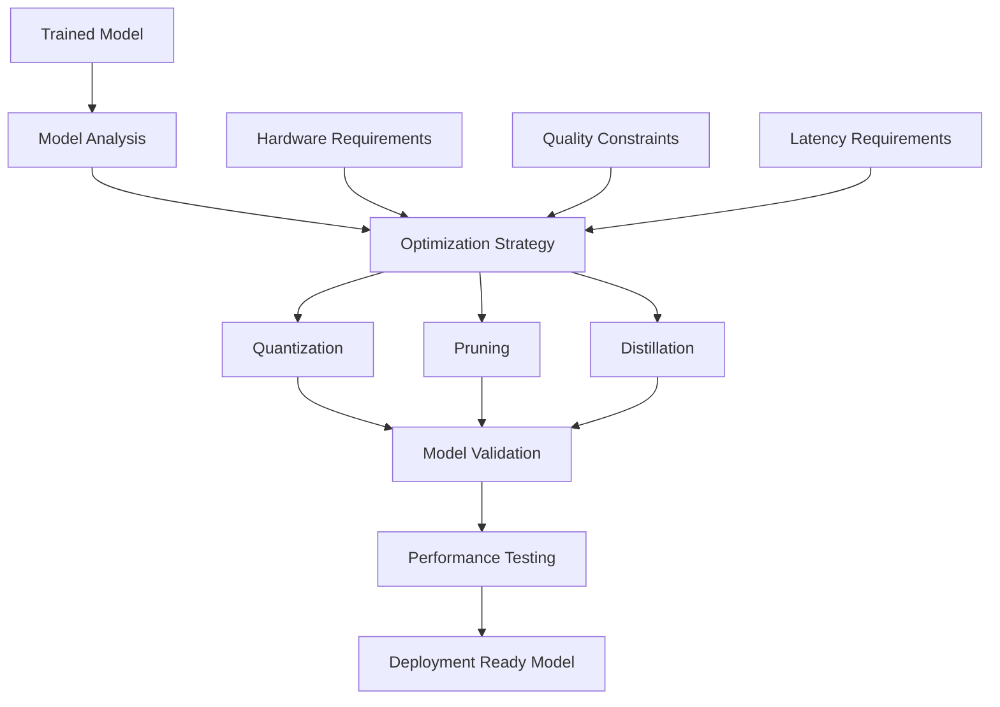

# Model Optimization Guide

Comprehensive guide for optimizing trained language models for performance, efficiency, and deployment.

## 📋 Table of Contents

- [Overview](#overview)
- [Quantization](#quantization)
- [Pruning](#pruning)
- [Knowledge Distillation](#knowledge-distillation)
- [Model Compression](#model-compression)
- [Inference Optimization](#inference-optimization)
- [Hardware-Specific Optimization](#hardware-specific-optimization)
- [Memory Optimization](#memory-optimization)
- [Deployment Optimization](#deployment-optimization)
- [Performance Benchmarking](#performance-benchmarking)
- [Best Practices](#best-practices)
- [Troubleshooting](#troubleshooting)

## 🔍 Overview

Model optimization is crucial for deploying language models efficiently in production environments. This guide covers various techniques to reduce model size, improve inference speed, and optimize memory usage while maintaining model quality.

### Optimization Techniques Comparison

| Technique | Size Reduction | Speed Improvement | Quality Impact | Complexity |
|-----------|----------------|-------------------|----------------|-----------|
| **Quantization** | 50-75% | 2-4x | Low-Medium | Low |
| **Pruning** | 30-90% | 1.5-3x | Low-High | Medium |
| **Distillation** | 50-90% | 2-10x | Medium | High |
| **Compression** | 20-50% | 1.2-2x | Low | Low |
| **ONNX Conversion** | 10-30% | 1.5-3x | None | Medium |

### Optimization Pipeline



## 🔢 Quantization

Quantization reduces model precision from 32-bit floats to lower precision formats (16-bit, 8-bit, or even 4-bit).

### Post-Training Quantization (PTQ)

#### Dynamic Quantization

```python
# Dynamic quantization with PyTorch
import torch
from transformers import AutoModelForCausalLM, AutoTokenizer

def dynamic_quantization(model_path, output_path):
    # Load model
    model = AutoModelForCausalLM.from_pretrained(model_path)
    
    # Apply dynamic quantization
    quantized_model = torch.quantization.quantize_dynamic(
        model,
        {torch.nn.Linear},  # Quantize linear layers
        dtype=torch.qint8   # Use 8-bit integers
    )
    
    # Save quantized model
    torch.save(quantized_model.state_dict(), f"{output_path}/quantized_model.pth")
    
    return quantized_model

# Usage
quantized_model = dynamic_quantization(
    model_path="./models/trained",
    output_path="./models/quantized"
)
```

#### Static Quantization

```python
# Static quantization with calibration
from torch.quantization import get_default_qconfig, prepare, convert

def static_quantization(model, calibration_data):
    # Set quantization configuration
    model.qconfig = get_default_qconfig('fbgemm')
    
    # Prepare model for quantization
    prepared_model = prepare(model, inplace=False)
    
    # Calibrate with representative data
    prepared_model.eval()
    with torch.no_grad():
        for batch in calibration_data:
            prepared_model(batch)
    
    # Convert to quantized model
    quantized_model = convert(prepared_model, inplace=False)
    
    return quantized_model

# Usage with calibration data
calibration_loader = create_calibration_dataloader()
quantized_model = static_quantization(model, calibration_loader)
```

### Quantization-Aware Training (QAT)

```python
# Quantization-aware training
from torch.quantization import get_default_qat_qconfig, prepare_qat, convert

class QATTrainer:
    def __init__(self, model, config):
        self.model = model
        self.config = config
        
        # Set QAT configuration
        self.model.qconfig = get_default_qat_qconfig('fbgemm')
        self.model = prepare_qat(self.model)
        
    def train_qat(self, train_loader, num_epochs=3):
        self.model.train()
        optimizer = torch.optim.AdamW(self.model.parameters(), lr=1e-5)
        
        for epoch in range(num_epochs):
            for batch in train_loader:
                optimizer.zero_grad()
                
                # Forward pass
                outputs = self.model(**batch)
                loss = outputs.loss
                
                # Backward pass
                loss.backward()
                optimizer.step()
                
                # Update quantization parameters
                if hasattr(self.model, 'apply_qat'):
                    self.model.apply_qat()
        
        # Convert to quantized model
        self.model.eval()
        quantized_model = convert(self.model, inplace=False)
        
        return quantized_model
```

### Advanced Quantization Techniques

#### GPTQ (Gradient-based Post-training Quantization)

```python
# GPTQ quantization
from auto_gptq import AutoGPTQForCausalLM, BaseQuantizeConfig

def gptq_quantization(model_path, calibration_data, output_path):
    # Configure quantization
    quantize_config = BaseQuantizeConfig(
        bits=4,                    # 4-bit quantization
        group_size=128,           # Group size for quantization
        desc_act=False,           # Disable activation quantization
        damp_percent=0.1,         # Damping factor
    )
    
    # Load model for quantization
    model = AutoGPTQForCausalLM.from_pretrained(
        model_path,
        quantize_config=quantize_config
    )
    
    # Quantize model
    model.quantize(calibration_data)
    
    # Save quantized model
    model.save_quantized(output_path)
    
    return model

# Usage
calibration_data = load_calibration_data()
quantized_model = gptq_quantization(
    model_path="./models/trained",
    calibration_data=calibration_data,
    output_path="./models/gptq_quantized"
)
```

#### AWQ (Activation-aware Weight Quantization)

```python
# AWQ quantization
from awq import AutoAWQForCausalLM
from transformers import AutoTokenizer

def awq_quantization(model_path, output_path):
    # Load model and tokenizer
    model = AutoAWQForCausalLM.from_pretrained(model_path)
    tokenizer = AutoTokenizer.from_pretrained(model_path)
    
    # Quantize model
    model.quantize(tokenizer, quant_config={"zero_point": True, "q_group_size": 128})
    
    # Save quantized model
    model.save_quantized(output_path)
    
    return model
```

## ✂️ Pruning

Pruning removes unnecessary weights or entire neurons/layers from the model.

### Magnitude-based Pruning

```python
# Magnitude-based pruning
import torch.nn.utils.prune as prune

class MagnitudePruner:
    def __init__(self, model, pruning_ratio=0.2):
        self.model = model
        self.pruning_ratio = pruning_ratio
        
    def prune_model(self):
        # Apply magnitude-based pruning to linear layers
        for name, module in self.model.named_modules():
            if isinstance(module, torch.nn.Linear):
                prune.l1_unstructured(module, name='weight', amount=self.pruning_ratio)
                
        return self.model
    
    def remove_pruning_masks(self):
        # Remove pruning masks and make pruning permanent
        for name, module in self.model.named_modules():
            if isinstance(module, torch.nn.Linear):
                prune.remove(module, 'weight')
                
        return self.model

# Usage
pruner = MagnitudePruner(model, pruning_ratio=0.3)
pruned_model = pruner.prune_model()

# Fine-tune pruned model
fine_tune_pruned_model(pruned_model, train_loader, num_epochs=2)

# Make pruning permanent
final_model = pruner.remove_pruning_masks()
```

### Structured Pruning

```python
# Structured pruning (remove entire neurons/channels)
class StructuredPruner:
    def __init__(self, model, pruning_ratio=0.2):
        self.model = model
        self.pruning_ratio = pruning_ratio
        
    def calculate_importance_scores(self, layer):
        # Calculate importance based on L1 norm of weights
        if hasattr(layer, 'weight'):
            return torch.norm(layer.weight, p=1, dim=1)
        return None
    
    def prune_layer(self, layer, importance_scores):
        # Determine neurons to prune
        num_neurons = len(importance_scores)
        num_to_prune = int(num_neurons * self.pruning_ratio)
        
        # Get indices of least important neurons
        _, indices_to_prune = torch.topk(importance_scores, num_to_prune, largest=False)
        
        # Create mask
        mask = torch.ones(num_neurons, dtype=torch.bool)
        mask[indices_to_prune] = False
        
        return mask
    
    def apply_structured_pruning(self):
        pruned_model = copy.deepcopy(self.model)
        
        for name, module in pruned_model.named_modules():
            if isinstance(module, torch.nn.Linear):
                importance_scores = self.calculate_importance_scores(module)
                if importance_scores is not None:
                    mask = self.prune_layer(module, importance_scores)
                    
                    # Apply mask to weights
                    module.weight.data = module.weight.data[mask]
                    if module.bias is not None:
                        module.bias.data = module.bias.data[mask]
                        
        return pruned_model
```

### Gradual Pruning

```python
# Gradual pruning during training
class GradualPruner:
    def __init__(self, model, initial_sparsity=0.0, final_sparsity=0.8, pruning_steps=1000):
        self.model = model
        self.initial_sparsity = initial_sparsity
        self.final_sparsity = final_sparsity
        self.pruning_steps = pruning_steps
        self.current_step = 0
        
    def get_current_sparsity(self):
        # Calculate current sparsity using polynomial decay
        if self.current_step >= self.pruning_steps:
            return self.final_sparsity
            
        progress = self.current_step / self.pruning_steps
        return self.initial_sparsity + (self.final_sparsity - self.initial_sparsity) * (progress ** 3)
    
    def apply_gradual_pruning(self):
        current_sparsity = self.get_current_sparsity()
        
        for name, module in self.model.named_modules():
            if isinstance(module, torch.nn.Linear):
                prune.l1_unstructured(module, name='weight', amount=current_sparsity)
                
        self.current_step += 1
        
    def train_with_gradual_pruning(self, train_loader, num_epochs):
        optimizer = torch.optim.AdamW(self.model.parameters(), lr=1e-5)
        
        for epoch in range(num_epochs):
            for batch_idx, batch in enumerate(train_loader):
                # Apply gradual pruning
                if batch_idx % 100 == 0:  # Prune every 100 steps
                    self.apply_gradual_pruning()
                
                # Training step
                optimizer.zero_grad()
                outputs = self.model(**batch)
                loss = outputs.loss
                loss.backward()
                optimizer.step()
```

## 🎓 Knowledge Distillation

Knowledge distillation trains a smaller "student" model to mimic a larger "teacher" model.

### Basic Knowledge Distillation

```python
# Knowledge distillation implementation
class KnowledgeDistiller:
    def __init__(self, teacher_model, student_model, temperature=4.0, alpha=0.7):
        self.teacher_model = teacher_model
        self.student_model = student_model
        self.temperature = temperature
        self.alpha = alpha  # Weight for distillation loss
        
        # Freeze teacher model
        for param in self.teacher_model.parameters():
            param.requires_grad = False
            
    def distillation_loss(self, student_logits, teacher_logits, labels):
        # Soft targets from teacher
        teacher_probs = torch.nn.functional.softmax(teacher_logits / self.temperature, dim=-1)
        student_log_probs = torch.nn.functional.log_softmax(student_logits / self.temperature, dim=-1)
        
        # KL divergence loss
        distillation_loss = torch.nn.functional.kl_div(
            student_log_probs, teacher_probs, reduction='batchmean'
        ) * (self.temperature ** 2)
        
        # Standard cross-entropy loss
        ce_loss = torch.nn.functional.cross_entropy(student_logits, labels)
        
        # Combined loss
        total_loss = self.alpha * distillation_loss + (1 - self.alpha) * ce_loss
        
        return total_loss
    
    def train_student(self, train_loader, num_epochs=3):
        optimizer = torch.optim.AdamW(self.student_model.parameters(), lr=2e-5)
        
        self.teacher_model.eval()
        self.student_model.train()
        
        for epoch in range(num_epochs):
            total_loss = 0
            
            for batch in train_loader:
                optimizer.zero_grad()
                
                # Get teacher predictions
                with torch.no_grad():
                    teacher_outputs = self.teacher_model(**batch)
                    teacher_logits = teacher_outputs.logits
                
                # Get student predictions
                student_outputs = self.student_model(**batch)
                student_logits = student_outputs.logits
                
                # Calculate distillation loss
                loss = self.distillation_loss(
                    student_logits, teacher_logits, batch['labels']
                )
                
                # Backward pass
                loss.backward()
                optimizer.step()
                
                total_loss += loss.item()
            
            avg_loss = total_loss / len(train_loader)
            print(f"Epoch {epoch+1}/{num_epochs}, Average Loss: {avg_loss:.4f}")
        
        return self.student_model
```

### Advanced Distillation Techniques

#### Feature-based Distillation

```python
# Feature-based knowledge distillation
class FeatureDistiller(KnowledgeDistiller):
    def __init__(self, teacher_model, student_model, feature_layers, **kwargs):
        super().__init__(teacher_model, student_model, **kwargs)
        self.feature_layers = feature_layers
        self.feature_adapters = self.create_feature_adapters()
        
    def create_feature_adapters(self):
        # Create adapters to match feature dimensions
        adapters = torch.nn.ModuleDict()
        
        for layer_name in self.feature_layers:
            teacher_dim = self.get_feature_dim(self.teacher_model, layer_name)
            student_dim = self.get_feature_dim(self.student_model, layer_name)
            
            if teacher_dim != student_dim:
                adapters[layer_name] = torch.nn.Linear(student_dim, teacher_dim)
            else:
                adapters[layer_name] = torch.nn.Identity()
                
        return adapters
    
    def feature_distillation_loss(self, student_features, teacher_features):
        total_loss = 0
        
        for layer_name in self.feature_layers:
            student_feat = student_features[layer_name]
            teacher_feat = teacher_features[layer_name]
            
            # Adapt student features
            adapted_student_feat = self.feature_adapters[layer_name](student_feat)
            
            # MSE loss between features
            feat_loss = torch.nn.functional.mse_loss(adapted_student_feat, teacher_feat)
            total_loss += feat_loss
            
        return total_loss / len(self.feature_layers)
```

#### Progressive Distillation

```python
# Progressive knowledge distillation
class ProgressiveDistiller:
    def __init__(self, teacher_model, intermediate_sizes, final_student_size):
        self.teacher_model = teacher_model
        self.intermediate_sizes = intermediate_sizes
        self.final_student_size = final_student_size
        
    def create_intermediate_models(self):
        models = []
        current_teacher = self.teacher_model
        
        for size in self.intermediate_sizes:
            # Create intermediate model
            student = self.create_model_with_size(size)
            
            # Distill knowledge
            distiller = KnowledgeDistiller(current_teacher, student)
            trained_student = distiller.train_student(train_loader)
            
            models.append(trained_student)
            current_teacher = trained_student
            
        # Final distillation
        final_student = self.create_model_with_size(self.final_student_size)
        final_distiller = KnowledgeDistiller(current_teacher, final_student)
        final_model = final_distiller.train_student(train_loader)
        
        return final_model
```

## 🗜️ Model Compression

### Weight Sharing

```python
# Weight sharing for model compression
class WeightSharing:
    def __init__(self, model, sharing_groups):
        self.model = model
        self.sharing_groups = sharing_groups
        
    def apply_weight_sharing(self):
        for group in self.sharing_groups:
            # Get reference weights from first layer in group
            reference_layer = None
            for layer_name in group:
                layer = self.get_layer_by_name(layer_name)
                if reference_layer is None:
                    reference_layer = layer
                else:
                    # Share weights
                    layer.weight = reference_layer.weight
                    if hasattr(layer, 'bias') and hasattr(reference_layer, 'bias'):
                        layer.bias = reference_layer.bias
                        
        return self.model
```

### Low-Rank Decomposition

```python
# Low-rank decomposition for weight matrices
class LowRankDecomposition:
    def __init__(self, model, rank_ratio=0.5):
        self.model = model
        self.rank_ratio = rank_ratio
        
    def decompose_linear_layer(self, layer):
        weight = layer.weight.data
        bias = layer.bias.data if layer.bias is not None else None
        
        # SVD decomposition
        U, S, V = torch.svd(weight)
        
        # Determine rank
        original_rank = min(weight.shape)
        new_rank = int(original_rank * self.rank_ratio)
        
        # Truncate
        U_truncated = U[:, :new_rank]
        S_truncated = S[:new_rank]
        V_truncated = V[:, :new_rank]
        
        # Create two linear layers
        layer1 = torch.nn.Linear(weight.shape[1], new_rank, bias=False)
        layer2 = torch.nn.Linear(new_rank, weight.shape[0], bias=bias is not None)
        
        # Set weights
        layer1.weight.data = (V_truncated * S_truncated.sqrt()).T
        layer2.weight.data = U_truncated * S_truncated.sqrt()
        
        if bias is not None:
            layer2.bias.data = bias
            
        return torch.nn.Sequential(layer1, layer2)
    
    def apply_decomposition(self):
        # Replace linear layers with decomposed versions
        for name, module in self.model.named_children():
            if isinstance(module, torch.nn.Linear):
                decomposed = self.decompose_linear_layer(module)
                setattr(self.model, name, decomposed)
                
        return self.model
```

## ⚡ Inference Optimization

### ONNX Conversion

```python
# Convert PyTorch model to ONNX
import torch.onnx
import onnx
import onnxruntime as ort

def convert_to_onnx(model, tokenizer, output_path, optimize=True):
    # Prepare dummy input
    dummy_input = tokenizer(
        "Hello world", 
        return_tensors="pt", 
        max_length=512, 
        padding="max_length", 
        truncation=True
    )
    
    # Export to ONNX
    torch.onnx.export(
        model,
        (dummy_input['input_ids'], dummy_input['attention_mask']),
        output_path,
        export_params=True,
        opset_version=14,
        do_constant_folding=True,
        input_names=['input_ids', 'attention_mask'],
        output_names=['logits'],
        dynamic_axes={
            'input_ids': {0: 'batch_size', 1: 'sequence'},
            'attention_mask': {0: 'batch_size', 1: 'sequence'},
            'logits': {0: 'batch_size', 1: 'sequence'}
        }
    )
    
    if optimize:
        # Optimize ONNX model
        from onnxruntime.tools import optimizer
        optimized_model = optimizer.optimize_model(
            output_path,
            model_type='bert',
            num_heads=12,
            hidden_size=768
        )
        optimized_model.save_model_to_file(output_path.replace('.onnx', '_optimized.onnx'))
    
    return output_path

# ONNX Runtime inference
class ONNXInferenceEngine:
    def __init__(self, onnx_model_path, providers=None):
        if providers is None:
            providers = ['CUDAExecutionProvider', 'CPUExecutionProvider']
            
        self.session = ort.InferenceSession(onnx_model_path, providers=providers)
        
    def predict(self, input_ids, attention_mask):
        inputs = {
            'input_ids': input_ids.numpy(),
            'attention_mask': attention_mask.numpy()
        }
        
        outputs = self.session.run(None, inputs)
        return torch.from_numpy(outputs[0])
```

### TensorRT Optimization

```python
# TensorRT optimization for NVIDIA GPUs
import tensorrt as trt
import pycuda.driver as cuda
import pycuda.autoinit

class TensorRTOptimizer:
    def __init__(self, onnx_model_path, max_batch_size=1, precision='fp16'):
        self.onnx_model_path = onnx_model_path
        self.max_batch_size = max_batch_size
        self.precision = precision
        
    def build_engine(self, engine_path):
        logger = trt.Logger(trt.Logger.WARNING)
        builder = trt.Builder(logger)
        network = builder.create_network(1 << int(trt.NetworkDefinitionCreationFlag.EXPLICIT_BATCH))
        parser = trt.OnnxParser(network, logger)
        
        # Parse ONNX model
        with open(self.onnx_model_path, 'rb') as model:
            if not parser.parse(model.read()):
                for error in range(parser.num_errors):
                    print(parser.get_error(error))
                return None
        
        # Configure builder
        config = builder.create_builder_config()
        config.max_workspace_size = 1 << 30  # 1GB
        
        if self.precision == 'fp16':
            config.set_flag(trt.BuilderFlag.FP16)
        elif self.precision == 'int8':
            config.set_flag(trt.BuilderFlag.INT8)
            # Add calibration data for INT8
            
        # Build engine
        engine = builder.build_engine(network, config)
        
        # Save engine
        with open(engine_path, 'wb') as f:
            f.write(engine.serialize())
            
        return engine
    
    def load_engine(self, engine_path):
        logger = trt.Logger(trt.Logger.WARNING)
        runtime = trt.Runtime(logger)
        
        with open(engine_path, 'rb') as f:
            engine_data = f.read()
            
        engine = runtime.deserialize_cuda_engine(engine_data)
        return engine
```

### Kernel Fusion

```python
# Custom kernel fusion for common operations
import torch.jit

@torch.jit.script
def fused_gelu_linear(x, weight, bias):
    # Fuse GELU activation with linear transformation
    linear_out = torch.nn.functional.linear(x, weight, bias)
    return torch.nn.functional.gelu(linear_out)

@torch.jit.script
def fused_layer_norm_linear(x, weight, bias, norm_weight, norm_bias, eps=1e-5):
    # Fuse layer normalization with linear transformation
    normalized = torch.nn.functional.layer_norm(x, x.shape[-1:], norm_weight, norm_bias, eps)
    return torch.nn.functional.linear(normalized, weight, bias)

class OptimizedTransformerBlock(torch.nn.Module):
    def __init__(self, config):
        super().__init__()
        self.attention = OptimizedAttention(config)
        self.mlp_weight = torch.nn.Parameter(torch.randn(config.hidden_size, config.intermediate_size))
        self.mlp_bias = torch.nn.Parameter(torch.zeros(config.intermediate_size))
        self.norm_weight = torch.nn.Parameter(torch.ones(config.hidden_size))
        self.norm_bias = torch.nn.Parameter(torch.zeros(config.hidden_size))
        
    def forward(self, x):
        # Attention
        attn_out = self.attention(x)
        
        # Fused layer norm + linear + GELU
        mlp_out = fused_layer_norm_linear(
            attn_out, self.mlp_weight, self.mlp_bias, 
            self.norm_weight, self.norm_bias
        )
        
        return mlp_out
```

## 🖥️ Hardware-Specific Optimization

### CPU Optimization

```python
# CPU-specific optimizations
class CPUOptimizer:
    def __init__(self, model):
        self.model = model
        
    def optimize_for_cpu(self):
        # Enable MKLDNN optimization
        self.model = torch.jit.optimize_for_inference(self.model)
        
        # Set optimal number of threads
        torch.set_num_threads(torch.get_num_threads())
        
        # Enable CPU-specific optimizations
        torch.backends.mkldnn.enabled = True
        torch.backends.mkl.enabled = True
        
        return self.model
    
    def apply_cpu_quantization(self):
        # CPU-optimized quantization
        quantized_model = torch.quantization.quantize_dynamic(
            self.model,
            {torch.nn.Linear, torch.nn.LSTM, torch.nn.GRU},
            dtype=torch.qint8
        )
        
        return quantized_model
```

### GPU Optimization

```python
# GPU-specific optimizations
class GPUOptimizer:
    def __init__(self, model):
        self.model = model
        
    def optimize_for_gpu(self):
        # Enable Flash Attention
        if hasattr(self.model.config, 'use_flash_attention_2'):
            self.model.config.use_flash_attention_2 = True
            
        # Enable tensor cores
        torch.backends.cuda.matmul.allow_tf32 = True
        torch.backends.cudnn.allow_tf32 = True
        
        # Compile model for GPU
        if hasattr(torch, 'compile'):
            self.model = torch.compile(self.model, mode="reduce-overhead")
            
        return self.model
    
    def apply_gpu_quantization(self):
        # GPU-optimized quantization
        from transformers import BitsAndBytesConfig
        
        quantization_config = BitsAndBytesConfig(
            load_in_4bit=True,
            bnb_4bit_compute_dtype=torch.bfloat16,
            bnb_4bit_use_double_quant=True,
            bnb_4bit_quant_type="nf4"
        )
        
        return quantization_config
```

### Mobile Optimization

```python
# Mobile device optimization
class MobileOptimizer:
    def __init__(self, model):
        self.model = model
        
    def optimize_for_mobile(self):
        # Convert to TorchScript
        scripted_model = torch.jit.script(self.model)
        
        # Optimize for mobile
        from torch.utils.mobile_optimizer import optimize_for_mobile
        mobile_model = optimize_for_mobile(scripted_model)
        
        return mobile_model
    
    def quantize_for_mobile(self):
        # Mobile-specific quantization
        backend = "qnnpack"  # Optimized for ARM processors
        
        self.model.qconfig = torch.quantization.get_default_qconfig(backend)
        prepared_model = torch.quantization.prepare(self.model, inplace=False)
        
        # Calibrate (you would use actual data here)
        # calibrate_model(prepared_model, calibration_data)
        
        quantized_model = torch.quantization.convert(prepared_model, inplace=False)
        
        return quantized_model
```

## 💾 Memory Optimization

### Gradient Checkpointing

```python
# Advanced gradient checkpointing
class MemoryEfficientModel(torch.nn.Module):
    def __init__(self, config):
        super().__init__()
        self.config = config
        self.layers = torch.nn.ModuleList([
            TransformerLayer(config) for _ in range(config.num_layers)
        ])
        self.gradient_checkpointing = True
        
    def forward(self, x):
        if self.gradient_checkpointing and self.training:
            # Use gradient checkpointing for memory efficiency
            for layer in self.layers:
                x = torch.utils.checkpoint.checkpoint(layer, x)
        else:
            for layer in self.layers:
                x = layer(x)
                
        return x
```

### Memory-Mapped Models

```python
# Memory-mapped model loading
class MemoryMappedModel:
    def __init__(self, model_path):
        self.model_path = model_path
        self.model = None
        
    def load_model_lazy(self):
        # Load model with memory mapping
        from accelerate import init_empty_weights, load_checkpoint_and_dispatch
        
        with init_empty_weights():
            model = AutoModelForCausalLM.from_config(config)
            
        # Load with memory mapping
        model = load_checkpoint_and_dispatch(
            model,
            self.model_path,
            device_map="auto",
            no_split_module_classes=["TransformerBlock"]
        )
        
        return model
```

### Dynamic Batching

```python
# Dynamic batching for variable-length sequences
class DynamicBatcher:
    def __init__(self, max_batch_size=32, max_tokens=2048):
        self.max_batch_size = max_batch_size
        self.max_tokens = max_tokens
        self.pending_requests = []
        
    def add_request(self, request):
        self.pending_requests.append(request)
        
    def create_batch(self):
        if not self.pending_requests:
            return None
            
        batch = []
        total_tokens = 0
        
        for request in self.pending_requests:
            request_tokens = len(request['input_ids'])
            
            # Check if adding this request exceeds limits
            if (len(batch) >= self.max_batch_size or 
                total_tokens + request_tokens > self.max_tokens):
                break
                
            batch.append(request)
            total_tokens += request_tokens
            
        # Remove batched requests from pending
        self.pending_requests = self.pending_requests[len(batch):]
        
        return batch if batch else None
```

## 🚀 Deployment Optimization

### Model Serving Optimization

```python
# Optimized model serving
class OptimizedModelServer:
    def __init__(self, model_path, optimization_config):
        self.model = self.load_optimized_model(model_path, optimization_config)
        self.tokenizer = AutoTokenizer.from_pretrained(model_path)
        
    def load_optimized_model(self, model_path, config):
        # Load base model
        model = AutoModelForCausalLM.from_pretrained(model_path)
        
        # Apply optimizations based on config
        if config.get('quantization'):
            model = self.apply_quantization(model, config['quantization'])
            
        if config.get('pruning'):
            model = self.apply_pruning(model, config['pruning'])
            
        if config.get('compilation'):
            model = torch.compile(model, **config['compilation'])
            
        return model
    
    def generate_optimized(self, prompt, **kwargs):
        # Optimized generation with caching
        inputs = self.tokenizer(prompt, return_tensors="pt")
        
        with torch.no_grad():
            outputs = self.model.generate(
                **inputs,
                do_sample=True,
                use_cache=True,  # Enable KV cache
                **kwargs
            )
            
        return self.tokenizer.decode(outputs[0], skip_special_tokens=True)
```

### Batch Processing Optimization

```python
# Optimized batch processing
class BatchProcessor:
    def __init__(self, model, tokenizer, max_batch_size=8):
        self.model = model
        self.tokenizer = tokenizer
        self.max_batch_size = max_batch_size
        
    def process_batch(self, prompts):
        # Tokenize batch
        inputs = self.tokenizer(
            prompts,
            return_tensors="pt",
            padding=True,
            truncation=True,
            max_length=512
        )
        
        # Generate responses
        with torch.no_grad():
            outputs = self.model.generate(
                **inputs,
                max_new_tokens=100,
                do_sample=True,
                temperature=0.7,
                pad_token_id=self.tokenizer.eos_token_id
            )
        
        # Decode responses
        responses = []
        for i, output in enumerate(outputs):
            # Skip input tokens
            response_tokens = output[len(inputs['input_ids'][i]):]
            response = self.tokenizer.decode(response_tokens, skip_special_tokens=True)
            responses.append(response)
            
        return responses
    
    def process_requests(self, requests):
        all_responses = []
        
        # Process in batches
        for i in range(0, len(requests), self.max_batch_size):
            batch = requests[i:i + self.max_batch_size]
            batch_responses = self.process_batch(batch)
            all_responses.extend(batch_responses)
            
        return all_responses
```

## 📊 Performance Benchmarking

### Comprehensive Benchmarking

```python
# Performance benchmarking suite
class ModelBenchmark:
    def __init__(self, model, tokenizer, device='cuda'):
        self.model = model.to(device)
        self.tokenizer = tokenizer
        self.device = device
        
    def benchmark_inference(self, test_prompts, num_runs=100):
        results = {
            'latency': [],
            'throughput': [],
            'memory_usage': [],
            'gpu_utilization': []
        }
        
        for _ in range(num_runs):
            prompt = random.choice(test_prompts)
            
            # Measure latency
            start_time = time.time()
            
            inputs = self.tokenizer(prompt, return_tensors="pt").to(self.device)
            
            with torch.no_grad():
                outputs = self.model.generate(
                    **inputs,
                    max_new_tokens=50,
                    do_sample=False
                )
            
            end_time = time.time()
            latency = end_time - start_time
            
            # Calculate throughput (tokens/second)
            num_tokens = outputs.shape[1] - inputs['input_ids'].shape[1]
            throughput = num_tokens / latency
            
            # Measure memory usage
            if self.device == 'cuda':
                memory_usage = torch.cuda.memory_allocated() / 1024**3  # GB
                gpu_util = self.get_gpu_utilization()
            else:
                memory_usage = 0
                gpu_util = 0
            
            results['latency'].append(latency)
            results['throughput'].append(throughput)
            results['memory_usage'].append(memory_usage)
            results['gpu_utilization'].append(gpu_util)
        
        # Calculate statistics
        stats = {}
        for metric, values in results.items():
            stats[metric] = {
                'mean': np.mean(values),
                'std': np.std(values),
                'min': np.min(values),
                'max': np.max(values),
                'p50': np.percentile(values, 50),
                'p95': np.percentile(values, 95),
                'p99': np.percentile(values, 99)
            }
        
        return stats
    
    def benchmark_batch_processing(self, batch_sizes=[1, 2, 4, 8, 16]):
        results = {}
        
        for batch_size in batch_sizes:
            prompts = ["Hello, how are you?"] * batch_size
            
            start_time = time.time()
            
            inputs = self.tokenizer(
                prompts,
                return_tensors="pt",
                padding=True,
                truncation=True
            ).to(self.device)
            
            with torch.no_grad():
                outputs = self.model.generate(
                    **inputs,
                    max_new_tokens=50,
                    do_sample=False
                )
            
            end_time = time.time()
            
            total_tokens = outputs.numel() - inputs['input_ids'].numel()
            throughput = total_tokens / (end_time - start_time)
            
            results[batch_size] = {
                'latency': end_time - start_time,
                'throughput': throughput,
                'tokens_per_sample': total_tokens / batch_size
            }
        
        return results
    
    def get_gpu_utilization(self):
        try:
            import pynvml
            pynvml.nvmlInit()
            handle = pynvml.nvmlDeviceGetHandleByIndex(0)
            util = pynvml.nvmlDeviceGetUtilizationRates(handle)
            return util.gpu
        except:
            return 0
```

### Model Size Analysis

```python
# Model size and parameter analysis
class ModelAnalyzer:
    def __init__(self, model):
        self.model = model
        
    def analyze_model_size(self):
        total_params = sum(p.numel() for p in self.model.parameters())
        trainable_params = sum(p.numel() for p in self.model.parameters() if p.requires_grad)
        
        # Calculate model size in MB
        param_size = sum(p.numel() * p.element_size() for p in self.model.parameters())
        buffer_size = sum(b.numel() * b.element_size() for b in self.model.buffers())
        total_size = (param_size + buffer_size) / 1024**2  # MB
        
        return {
            'total_parameters': total_params,
            'trainable_parameters': trainable_params,
            'model_size_mb': total_size,
            'parameter_breakdown': self.get_parameter_breakdown()
        }
    
    def get_parameter_breakdown(self):
        breakdown = {}
        
        for name, module in self.model.named_modules():
            if len(list(module.children())) == 0:  # Leaf modules
                num_params = sum(p.numel() for p in module.parameters())
                if num_params > 0:
                    breakdown[name] = {
                        'parameters': num_params,
                        'type': type(module).__name__
                    }
        
        return breakdown
```

## ✅ Best Practices

### Optimization Strategy

1. **Profile First**: Always profile your model before optimization
2. **Incremental Optimization**: Apply optimizations incrementally and measure impact
3. **Quality Validation**: Validate model quality after each optimization
4. **Hardware-Specific**: Choose optimizations based on target hardware
5. **End-to-End Testing**: Test the complete pipeline, not just individual components

### Optimization Checklist

```yaml
# Optimization checklist
optimization_checklist:
  profiling:
    - [ ] Baseline performance measurement
    - [ ] Memory usage analysis
    - [ ] Bottleneck identification
    - [ ] Hardware utilization check
    
  model_optimization:
    - [ ] Quantization evaluation
    - [ ] Pruning assessment
    - [ ] Knowledge distillation consideration
    - [ ] Architecture optimization
    
  inference_optimization:
    - [ ] Batch size optimization
    - [ ] Sequence length optimization
    - [ ] KV cache utilization
    - [ ] Kernel fusion opportunities
    
  deployment_optimization:
    - [ ] Model format conversion (ONNX, TensorRT)
    - [ ] Hardware-specific optimizations
    - [ ] Memory management
    - [ ] Concurrent request handling
    
  validation:
    - [ ] Quality metrics comparison
    - [ ] Performance benchmarking
    - [ ] Stress testing
    - [ ] Production readiness check
```

### Quality Preservation

```python
# Quality preservation during optimization
class QualityValidator:
    def __init__(self, original_model, eval_dataset):
        self.original_model = original_model
        self.eval_dataset = eval_dataset
        self.baseline_metrics = self.evaluate_model(original_model)
        
    def validate_optimized_model(self, optimized_model, max_degradation=0.05):
        optimized_metrics = self.evaluate_model(optimized_model)
        
        quality_check = True
        degradation_report = {}
        
        for metric, baseline_value in self.baseline_metrics.items():
            optimized_value = optimized_metrics[metric]
            degradation = (baseline_value - optimized_value) / baseline_value
            
            degradation_report[metric] = {
                'baseline': baseline_value,
                'optimized': optimized_value,
                'degradation': degradation,
                'acceptable': degradation <= max_degradation
            }
            
            if degradation > max_degradation:
                quality_check = False
        
        return quality_check, degradation_report
    
    def evaluate_model(self, model):
        # Implement your evaluation metrics here
        metrics = {
            'perplexity': self.calculate_perplexity(model),
            'bleu_score': self.calculate_bleu(model),
            'accuracy': self.calculate_accuracy(model)
        }
        return metrics
```

## 🔧 Troubleshooting

### Common Optimization Issues

#### 1. Quality Degradation

```python
# Debugging quality degradation
def debug_quality_degradation(original_model, optimized_model, test_samples):
    for i, sample in enumerate(test_samples):
        # Compare outputs
        original_output = original_model.generate(**sample)
        optimized_output = optimized_model.generate(**sample)
        
        # Calculate similarity
        similarity = calculate_similarity(original_output, optimized_output)
        
        if similarity < 0.8:  # Threshold for concern
            print(f"Sample {i}: Low similarity ({similarity:.3f})")
            print(f"Original: {original_output}")
            print(f"Optimized: {optimized_output}")
            print("-" * 50)
```

#### 2. Performance Regression

```python
# Performance regression analysis
def analyze_performance_regression(baseline_metrics, optimized_metrics):
    regressions = []
    
    for metric, baseline_value in baseline_metrics.items():
        optimized_value = optimized_metrics.get(metric, 0)
        
        if metric in ['latency', 'memory_usage']:  # Lower is better
            if optimized_value > baseline_value * 1.1:  # 10% regression
                regressions.append({
                    'metric': metric,
                    'baseline': baseline_value,
                    'optimized': optimized_value,
                    'regression': (optimized_value - baseline_value) / baseline_value
                })
        else:  # Higher is better
            if optimized_value < baseline_value * 0.9:  # 10% regression
                regressions.append({
                    'metric': metric,
                    'baseline': baseline_value,
                    'optimized': optimized_value,
                    'regression': (baseline_value - optimized_value) / baseline_value
                })
    
    return regressions
```

#### 3. Memory Issues

```python
# Memory optimization debugging
def debug_memory_issues(model, sample_input):
    import tracemalloc
    
    tracemalloc.start()
    
    # Measure memory before
    if torch.cuda.is_available():
        torch.cuda.empty_cache()
        memory_before = torch.cuda.memory_allocated()
    
    # Run inference
    with torch.no_grad():
        output = model(**sample_input)
    
    # Measure memory after
    if torch.cuda.is_available():
        memory_after = torch.cuda.memory_allocated()
        memory_used = memory_after - memory_before
        
        print(f"GPU Memory used: {memory_used / 1024**2:.2f} MB")
        print(f"GPU Memory allocated: {memory_after / 1024**2:.2f} MB")
        print(f"GPU Memory cached: {torch.cuda.memory_reserved() / 1024**2:.2f} MB")
    
    # CPU memory
    current, peak = tracemalloc.get_traced_memory()
    print(f"CPU Memory current: {current / 1024**2:.2f} MB")
    print(f"CPU Memory peak: {peak / 1024**2:.2f} MB")
    
    tracemalloc.stop()
```

---

**Next Steps**: After optimizing your model, proceed to [Deployment Guide](./deployment-guide.md) for production deployment strategies.