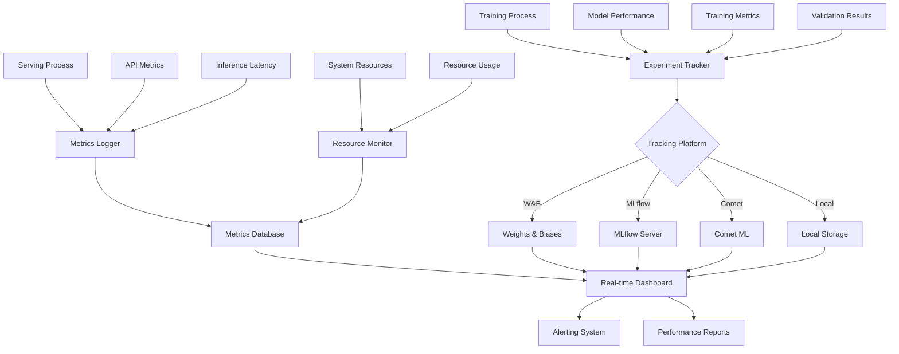

# Monitoring System Documentation

The monitoring system provides comprehensive experiment tracking, performance monitoring, and observability for the entire LLM training and serving pipeline, supporting multiple platforms and real-time analytics.

## 📁 Monitoring Components

| Component | File | Purpose |
|-----------|------|----------|
| **Experiment Tracker** | `experiment_tracker.py` | Unified experiment tracking across platforms |
| **Metrics Logger** | `metrics_logger.py` | Performance and system metrics collection |
| **Dashboard** | `dashboard.py` | Real-time monitoring dashboard |

## 🔄 Monitoring Architecture



## 🎯 Experiment Tracking

### Supported Platforms

#### 1. Weights & Biases (W&B)
**Best For**: Comprehensive experiment tracking, team collaboration

**Features**:
- Real-time metric logging
- Interactive visualizations
- Model versioning
- Hyperparameter sweeps
- Team collaboration
- Artifact management

**Configuration**:
```yaml
monitoring:
  experiment_tracking:
    platform: "wandb"
    wandb:
      project: "custom-llm-chatbot"
      entity: "your-team"
      tags: ["llm", "training", "production"]
      group: "experiment-group"
      job_type: "training"
      notes: "Training Qwen2.5-3B with LoRA"
      config_exclude_keys: ["api_key", "secrets"]
      log_code: true
      log_gradients: true
      log_parameters: true
```

**Usage Example**:
```python
from src.monitoring.experiment_tracker import ExperimentTracker

# Initialize W&B tracker
tracker = ExperimentTracker(
    platform="wandb",
    project="custom-llm-chatbot",
    name="qwen2.5-3b-lora-experiment"
)

# Log hyperparameters
tracker.log_hyperparameters({
    "model_name": "Qwen/Qwen2.5-3B",
    "learning_rate": 2e-4,
    "batch_size": 16,
    "lora_rank": 16,
    "lora_alpha": 32
})

# Log training metrics
for epoch in range(num_epochs):
    for step, batch in enumerate(dataloader):
        # Training step
        loss = train_step(batch)
        
        # Log metrics
        tracker.log_metrics({
            "train/loss": loss,
            "train/learning_rate": optimizer.param_groups[0]['lr'],
            "train/epoch": epoch,
            "train/step": step
        })

# Log model artifacts
tracker.log_model(
    model_path="./outputs/final_model",
    model_name="qwen2.5-3b-lora",
    metadata={"architecture": "transformer", "parameters": "3B"}
)
```

#### 2. MLflow
**Best For**: Model lifecycle management, deployment tracking

**Features**:
- Experiment organization
- Model registry
- Deployment tracking
- Metric comparison
- Reproducibility

**Configuration**:
```yaml
monitoring:
  experiment_tracking:
    platform: "mlflow"
    mlflow:
      tracking_uri: "http://localhost:5000"
      experiment_name: "llm-training"
      run_name: "qwen2.5-3b-{timestamp}"
      artifact_location: "./mlruns"
      registry_uri: "sqlite:///mlflow.db"
```

**Usage Example**:
```python
import mlflow
from src.monitoring.experiment_tracker import ExperimentTracker

# Initialize MLflow tracker
tracker = ExperimentTracker(
    platform="mlflow",
    experiment_name="llm-training"
)

with tracker.start_run(run_name="qwen2.5-3b-experiment"):
    # Log parameters
    tracker.log_params({
        "model_name": "Qwen/Qwen2.5-3B",
        "training_type": "lora",
        "dataset_size": 10000
    })
    
    # Training loop
    for epoch in range(num_epochs):
        train_loss = train_epoch()
        val_loss = validate_epoch()
        
        # Log metrics
        tracker.log_metrics({
            "train_loss": train_loss,
            "val_loss": val_loss
        }, step=epoch)
    
    # Log model
    mlflow.pytorch.log_model(
        pytorch_model=model,
        artifact_path="model",
        registered_model_name="qwen2.5-3b-lora"
    )
```

#### 3. Comet ML
**Best For**: Advanced experiment analysis, model optimization

**Features**:
- Automatic logging
- Code tracking
- System metrics
- Model optimization
- A/B testing

**Configuration**:
```yaml
monitoring:
  experiment_tracking:
    platform: "comet"
    comet:
      api_key: "${COMET_API_KEY}"
      project_name: "custom-llm-chatbot"
      workspace: "your-workspace"
      experiment_name: "qwen2.5-3b-training"
      auto_log: true
      log_code: true
      log_graph: true
```

#### 4. Local Tracking
**Best For**: Offline development, custom tracking needs

**Features**:
- No external dependencies
- Custom storage formats
- Privacy-focused
- Lightweight logging

**Configuration**:
```yaml
monitoring:
  experiment_tracking:
    platform: "local"
    local:
      log_dir: "./experiments"
      format: "json"  # json, csv, sqlite
      auto_save_interval: 100
      compress_logs: true
```

### Multi-Platform Tracking
```python
from src.monitoring.experiment_tracker import MultiPlatformTracker

# Track to multiple platforms simultaneously
tracker = MultiPlatformTracker([
    {"platform": "wandb", "project": "llm-training"},
    {"platform": "mlflow", "experiment_name": "llm-experiments"},
    {"platform": "local", "log_dir": "./logs"}
])

# All platforms will receive the same data
tracker.log_metrics({
    "train/loss": 0.5,
    "val/accuracy": 0.85
})

tracker.log_hyperparameters({
    "learning_rate": 2e-4,
    "batch_size": 16
})
```

## 📊 Performance Monitoring

### Training Metrics

#### Core Training Metrics
```python
from src.monitoring.metrics_logger import MetricsLogger

# Initialize metrics logger
metrics = MetricsLogger(
    log_interval=10,  # Log every 10 steps
    save_interval=100,  # Save to disk every 100 steps
    metrics_file="./logs/training_metrics.json"
)

# Training loop with comprehensive metrics
for epoch in range(num_epochs):
    epoch_start_time = time.time()
    
    for step, batch in enumerate(dataloader):
        step_start_time = time.time()
        
        # Forward pass
        outputs = model(**batch)
        loss = outputs.loss
        
        # Backward pass
        loss.backward()
        optimizer.step()
        scheduler.step()
        optimizer.zero_grad()
        
        step_time = time.time() - step_start_time
        
        # Log comprehensive metrics
        metrics.log({
            # Loss metrics
            "train/loss": loss.item(),
            "train/perplexity": torch.exp(loss).item(),
            
            # Learning rate
            "train/learning_rate": scheduler.get_last_lr()[0],
            
            # Performance metrics
            "train/step_time": step_time,
            "train/tokens_per_second": batch_size * seq_length / step_time,
            "train/samples_per_second": batch_size / step_time,
            
            # Memory metrics
            "system/gpu_memory_used": torch.cuda.memory_allocated() / 1e9,
            "system/gpu_memory_cached": torch.cuda.memory_reserved() / 1e9,
            
            # Gradient metrics
            "train/grad_norm": torch.nn.utils.clip_grad_norm_(model.parameters(), max_norm=1.0),
            
            # Progress metrics
            "train/epoch": epoch,
            "train/step": step,
            "train/global_step": epoch * len(dataloader) + step
        })
    
    # Validation metrics
    val_metrics = validate_model(model, val_dataloader)
    metrics.log({
        "val/loss": val_metrics["loss"],
        "val/perplexity": val_metrics["perplexity"],
        "val/accuracy": val_metrics["accuracy"],
        "val/bleu_score": val_metrics["bleu"],
        "epoch_time": time.time() - epoch_start_time
    })
```

#### Advanced Training Metrics
```python
# Custom metrics for specific training types
class DPOMetricsLogger(MetricsLogger):
    def log_dpo_metrics(self, chosen_rewards, rejected_rewards, margin):
        """Log DPO-specific metrics."""
        self.log({
            "dpo/chosen_reward_mean": chosen_rewards.mean().item(),
            "dpo/rejected_reward_mean": rejected_rewards.mean().item(),
            "dpo/reward_margin": margin.mean().item(),
            "dpo/reward_accuracy": (chosen_rewards > rejected_rewards).float().mean().item(),
            "dpo/chosen_reward_std": chosen_rewards.std().item(),
            "dpo/rejected_reward_std": rejected_rewards.std().item()
        })

# LoRA-specific metrics
class LoRAMetricsLogger(MetricsLogger):
    def log_lora_metrics(self, model):
        """Log LoRA-specific metrics."""
        total_params = sum(p.numel() for p in model.parameters())
        trainable_params = sum(p.numel() for p in model.parameters() if p.requires_grad)
        
        self.log({
            "lora/total_parameters": total_params,
            "lora/trainable_parameters": trainable_params,
            "lora/trainable_percentage": 100 * trainable_params / total_params,
            "lora/parameter_efficiency": total_params / trainable_params
        })
```

### Serving Metrics

#### API Performance Metrics
```python
from src.monitoring.metrics_logger import ServingMetricsLogger
import time
from functools import wraps

class APIMetricsMiddleware:
    def __init__(self):
        self.metrics = ServingMetricsLogger()
        self.request_count = 0
        self.total_latency = 0
        self.error_count = 0
    
    def track_request(self, func):
        @wraps(func)
        async def wrapper(*args, **kwargs):
            start_time = time.time()
            self.request_count += 1
            
            try:
                # Execute request
                result = await func(*args, **kwargs)
                
                # Calculate metrics
                latency = time.time() - start_time
                self.total_latency += latency
                
                # Log metrics
                self.metrics.log({
                    "api/request_count": self.request_count,
                    "api/request_latency": latency,
                    "api/avg_latency": self.total_latency / self.request_count,
                    "api/requests_per_second": self.request_count / (time.time() - self.start_time),
                    "api/tokens_generated": len(result.get('tokens', [])),
                    "api/tokens_per_second": len(result.get('tokens', [])) / latency if latency > 0 else 0
                })
                
                return result
                
            except Exception as e:
                self.error_count += 1
                self.metrics.log({
                    "api/error_count": self.error_count,
                    "api/error_rate": self.error_count / self.request_count,
                    "api/error_type": type(e).__name__
                })
                raise
        
        return wrapper

# Usage in FastAPI
from fastapi import FastAPI
app = FastAPI()
metrics_middleware = APIMetricsMiddleware()

@app.post("/generate")
@metrics_middleware.track_request
async def generate_text(request: GenerateRequest):
    # Generation logic
    result = await model_server.generate(request)
    return result
```

#### Model Performance Metrics
```python
class ModelPerformanceMonitor:
    def __init__(self, model_server):
        self.model_server = model_server
        self.metrics = ServingMetricsLogger()
        self.performance_history = []
    
    def monitor_inference(self, request, response):
        """Monitor individual inference performance."""
        metrics = {
            # Latency metrics
            "inference/total_time": response.generation_time,
            "inference/time_to_first_token": response.time_to_first_token,
            "inference/tokens_per_second": response.tokens_per_second,
            
            # Quality metrics
            "inference/tokens_generated": response.tokens_generated,
            "inference/prompt_length": len(request.prompt),
            "inference/completion_ratio": response.tokens_generated / request.max_tokens,
            
            # Resource metrics
            "inference/gpu_memory_used": self.get_gpu_memory_usage(),
            "inference/cpu_usage": self.get_cpu_usage(),
            
            # Request characteristics
            "inference/temperature": request.temperature,
            "inference/max_tokens": request.max_tokens,
            "inference/batch_size": getattr(request, 'batch_size', 1)
        }
        
        self.metrics.log(metrics)
        self.performance_history.append(metrics)
        
        # Alert on performance degradation
        self.check_performance_alerts(metrics)
    
    def check_performance_alerts(self, metrics):
        """Check for performance issues and send alerts."""
        if metrics["inference/tokens_per_second"] < 10:
            self.send_alert("Low inference speed detected", metrics)
        
        if metrics["inference/gpu_memory_used"] > 0.95:
            self.send_alert("High GPU memory usage", metrics)
    
    def get_performance_summary(self, window_minutes=60):
        """Get performance summary for the last N minutes."""
        cutoff_time = time.time() - (window_minutes * 60)
        recent_metrics = [
            m for m in self.performance_history 
            if m.get('timestamp', 0) > cutoff_time
        ]
        
        if not recent_metrics:
            return {}
        
        return {
            "avg_latency": np.mean([m["inference/total_time"] for m in recent_metrics]),
            "p95_latency": np.percentile([m["inference/total_time"] for m in recent_metrics], 95),
            "avg_tokens_per_second": np.mean([m["inference/tokens_per_second"] for m in recent_metrics]),
            "total_requests": len(recent_metrics),
            "avg_gpu_memory": np.mean([m["inference/gpu_memory_used"] for m in recent_metrics])
        }
```

### System Resource Monitoring

#### GPU Monitoring
```python
import pynvml
from src.monitoring.metrics_logger import SystemMetricsLogger

class GPUMonitor:
    def __init__(self):
        pynvml.nvmlInit()
        self.device_count = pynvml.nvmlDeviceGetCount()
        self.metrics = SystemMetricsLogger()
    
    def collect_gpu_metrics(self):
        """Collect comprehensive GPU metrics."""
        for i in range(self.device_count):
            handle = pynvml.nvmlDeviceGetHandleByIndex(i)
            
            # Memory info
            mem_info = pynvml.nvmlDeviceGetMemoryInfo(handle)
            
            # Utilization
            util = pynvml.nvmlDeviceGetUtilizationRates(handle)
            
            # Temperature
            temp = pynvml.nvmlDeviceGetTemperature(handle, pynvml.NVML_TEMPERATURE_GPU)
            
            # Power
            power = pynvml.nvmlDeviceGetPowerUsage(handle) / 1000.0  # Convert to watts
            
            self.metrics.log({
                f"gpu_{i}/memory_used_gb": mem_info.used / 1e9,
                f"gpu_{i}/memory_total_gb": mem_info.total / 1e9,
                f"gpu_{i}/memory_utilization": mem_info.used / mem_info.total,
                f"gpu_{i}/gpu_utilization": util.gpu / 100.0,
                f"gpu_{i}/memory_bandwidth_utilization": util.memory / 100.0,
                f"gpu_{i}/temperature_c": temp,
                f"gpu_{i}/power_usage_w": power
            })
    
    def start_monitoring(self, interval=10):
        """Start continuous GPU monitoring."""
        import threading
        import time
        
        def monitor_loop():
            while True:
                self.collect_gpu_metrics()
                time.sleep(interval)
        
        monitor_thread = threading.Thread(target=monitor_loop, daemon=True)
        monitor_thread.start()
```

#### CPU and Memory Monitoring
```python
import psutil
from src.monitoring.metrics_logger import SystemMetricsLogger

class SystemMonitor:
    def __init__(self):
        self.metrics = SystemMetricsLogger()
        self.process = psutil.Process()
    
    def collect_system_metrics(self):
        """Collect comprehensive system metrics."""
        # CPU metrics
        cpu_percent = psutil.cpu_percent(interval=1)
        cpu_count = psutil.cpu_count()
        load_avg = psutil.getloadavg() if hasattr(psutil, 'getloadavg') else (0, 0, 0)
        
        # Memory metrics
        memory = psutil.virtual_memory()
        swap = psutil.swap_memory()
        
        # Process-specific metrics
        process_memory = self.process.memory_info()
        process_cpu = self.process.cpu_percent()
        
        # Disk metrics
        disk = psutil.disk_usage('/')
        
        # Network metrics
        network = psutil.net_io_counters()
        
        self.metrics.log({
            # CPU metrics
            "system/cpu_percent": cpu_percent,
            "system/cpu_count": cpu_count,
            "system/load_avg_1m": load_avg[0],
            "system/load_avg_5m": load_avg[1],
            "system/load_avg_15m": load_avg[2],
            
            # Memory metrics
            "system/memory_total_gb": memory.total / 1e9,
            "system/memory_used_gb": memory.used / 1e9,
            "system/memory_percent": memory.percent,
            "system/swap_total_gb": swap.total / 1e9,
            "system/swap_used_gb": swap.used / 1e9,
            
            # Process metrics
            "process/memory_rss_gb": process_memory.rss / 1e9,
            "process/memory_vms_gb": process_memory.vms / 1e9,
            "process/cpu_percent": process_cpu,
            
            # Disk metrics
            "system/disk_total_gb": disk.total / 1e9,
            "system/disk_used_gb": disk.used / 1e9,
            "system/disk_percent": disk.used / disk.total * 100,
            
            # Network metrics
            "system/network_bytes_sent": network.bytes_sent,
            "system/network_bytes_recv": network.bytes_recv
        })
```

## 📈 Real-time Dashboard

### Streamlit Dashboard
```python
import streamlit as st
import plotly.graph_objects as go
import plotly.express as px
from src.monitoring.metrics_logger import MetricsReader

class MonitoringDashboard:
    def __init__(self):
        self.metrics_reader = MetricsReader()
        
    def create_dashboard(self):
        st.set_page_config(
            page_title="LLM Monitoring Dashboard",
            page_icon="📊",
            layout="wide"
        )
        
        st.title("🤖 LLM Training & Serving Monitor")
        
        # Sidebar for controls
        with st.sidebar:
            st.header("Controls")
            refresh_interval = st.selectbox(
                "Refresh Interval",
                [5, 10, 30, 60],
                index=1
            )
            
            time_window = st.selectbox(
                "Time Window",
                ["1h", "6h", "24h", "7d"],
                index=1
            )
            
            auto_refresh = st.checkbox("Auto Refresh", value=True)
        
        # Main dashboard
        self.render_overview()
        self.render_training_metrics(time_window)
        self.render_serving_metrics(time_window)
        self.render_system_metrics(time_window)
        
        # Auto refresh
        if auto_refresh:
            time.sleep(refresh_interval)
            st.experimental_rerun()
    
    def render_overview(self):
        """Render overview metrics."""
        st.header("📊 Overview")
        
        col1, col2, col3, col4 = st.columns(4)
        
        with col1:
            current_loss = self.metrics_reader.get_latest("train/loss")
            st.metric(
                "Current Loss",
                f"{current_loss:.4f}" if current_loss else "N/A",
                delta=self.metrics_reader.get_delta("train/loss")
            )
        
        with col2:
            tokens_per_sec = self.metrics_reader.get_latest("api/tokens_per_second")
            st.metric(
                "Tokens/Second",
                f"{tokens_per_sec:.1f}" if tokens_per_sec else "N/A",
                delta=self.metrics_reader.get_delta("api/tokens_per_second")
            )
        
        with col3:
            gpu_memory = self.metrics_reader.get_latest("gpu_0/memory_utilization")
            st.metric(
                "GPU Memory",
                f"{gpu_memory*100:.1f}%" if gpu_memory else "N/A",
                delta=self.metrics_reader.get_delta("gpu_0/memory_utilization")
            )
        
        with col4:
            request_count = self.metrics_reader.get_latest("api/request_count")
            st.metric(
                "Total Requests",
                f"{request_count:,}" if request_count else "N/A",
                delta=self.metrics_reader.get_delta("api/request_count")
            )
    
    def render_training_metrics(self, time_window):
        """Render training metrics charts."""
        st.header("🎯 Training Metrics")
        
        col1, col2 = st.columns(2)
        
        with col1:
            # Loss chart
            loss_data = self.metrics_reader.get_time_series("train/loss", time_window)
            if loss_data:
                fig = px.line(
                    loss_data,
                    x="timestamp",
                    y="value",
                    title="Training Loss"
                )
                st.plotly_chart(fig, use_container_width=True)
        
        with col2:
            # Learning rate chart
            lr_data = self.metrics_reader.get_time_series("train/learning_rate", time_window)
            if lr_data:
                fig = px.line(
                    lr_data,
                    x="timestamp",
                    y="value",
                    title="Learning Rate"
                )
                st.plotly_chart(fig, use_container_width=True)
    
    def render_serving_metrics(self, time_window):
        """Render serving metrics charts."""
        st.header("🚀 Serving Metrics")
        
        col1, col2 = st.columns(2)
        
        with col1:
            # Latency chart
            latency_data = self.metrics_reader.get_time_series("api/request_latency", time_window)
            if latency_data:
                fig = px.histogram(
                    latency_data,
                    x="value",
                    title="Request Latency Distribution"
                )
                st.plotly_chart(fig, use_container_width=True)
        
        with col2:
            # Throughput chart
            throughput_data = self.metrics_reader.get_time_series("api/tokens_per_second", time_window)
            if throughput_data:
                fig = px.line(
                    throughput_data,
                    x="timestamp",
                    y="value",
                    title="Inference Throughput"
                )
                st.plotly_chart(fig, use_container_width=True)
    
    def render_system_metrics(self, time_window):
        """Render system metrics charts."""
        st.header("💻 System Metrics")
        
        col1, col2 = st.columns(2)
        
        with col1:
            # GPU utilization
            gpu_data = self.metrics_reader.get_time_series("gpu_0/gpu_utilization", time_window)
            if gpu_data:
                fig = px.line(
                    gpu_data,
                    x="timestamp",
                    y="value",
                    title="GPU Utilization"
                )
                fig.update_yaxis(range=[0, 1])
                st.plotly_chart(fig, use_container_width=True)
        
        with col2:
            # Memory usage
            memory_data = self.metrics_reader.get_time_series("system/memory_percent", time_window)
            if memory_data:
                fig = px.line(
                    memory_data,
                    x="timestamp",
                    y="value",
                    title="System Memory Usage"
                )
                st.plotly_chart(fig, use_container_width=True)

# Run dashboard
if __name__ == "__main__":
    dashboard = MonitoringDashboard()
    dashboard.create_dashboard()
```

## 🚨 Alerting System

### Alert Configuration
```python
from src.monitoring.alerting import AlertManager

# Configure alerts
alert_config = {
    "channels": {
        "email": {
            "enabled": True,
            "smtp_server": "smtp.gmail.com",
            "smtp_port": 587,
            "username": "alerts@company.com",
            "password": "${EMAIL_PASSWORD}",
            "recipients": ["team@company.com"]
        },
        "slack": {
            "enabled": True,
            "webhook_url": "${SLACK_WEBHOOK_URL}",
            "channel": "#ml-alerts"
        },
        "discord": {
            "enabled": False,
            "webhook_url": "${DISCORD_WEBHOOK_URL}"
        }
    },
    "rules": [
        {
            "name": "High Training Loss",
            "metric": "train/loss",
            "condition": ">",
            "threshold": 5.0,
            "duration": "5m",
            "severity": "warning"
        },
        {
            "name": "Low Inference Speed",
            "metric": "api/tokens_per_second",
            "condition": "<",
            "threshold": 10,
            "duration": "2m",
            "severity": "critical"
        },
        {
            "name": "High GPU Memory",
            "metric": "gpu_0/memory_utilization",
            "condition": ">",
            "threshold": 0.95,
            "duration": "1m",
            "severity": "warning"
        },
        {
            "name": "High Error Rate",
            "metric": "api/error_rate",
            "condition": ">",
            "threshold": 0.05,
            "duration": "3m",
            "severity": "critical"
        }
    ]
}

# Initialize alert manager
alert_manager = AlertManager(alert_config)
alert_manager.start_monitoring()
```

### Custom Alert Handlers
```python
class CustomAlertHandler:
    def __init__(self, webhook_url):
        self.webhook_url = webhook_url
    
    def send_alert(self, alert):
        """Send custom alert notification."""
        payload = {
            "alert_name": alert.name,
            "metric": alert.metric,
            "current_value": alert.current_value,
            "threshold": alert.threshold,
            "severity": alert.severity,
            "timestamp": alert.timestamp,
            "message": f"Alert: {alert.name} - {alert.metric} is {alert.current_value} (threshold: {alert.threshold})"
        }
        
        # Send to custom endpoint
        requests.post(self.webhook_url, json=payload)

# Register custom handler
alert_manager.register_handler("custom", CustomAlertHandler("https://api.company.com/alerts"))
```

This comprehensive monitoring system provides complete observability into your LLM training and serving pipeline, enabling proactive performance optimization and issue resolution.