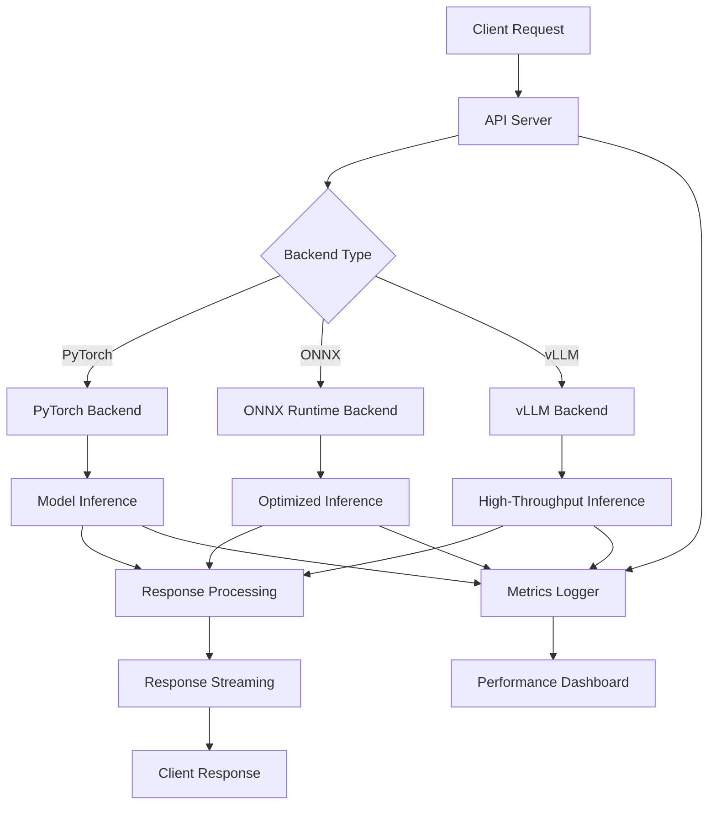

# Serving System Documentation

The serving system provides high-performance, scalable inference capabilities with multiple backend options, comprehensive API endpoints, and production-ready features for deploying Large Language Models.

## 📁 Serving Components

| Component | File | Purpose |
|-----------|------|----------|
| **Model Server** | `model_server.py` | Core inference engine with multiple backends |
| **API Server** | `api_server.py` | FastAPI-based REST API with comprehensive endpoints |
| **vLLM Server** | `vllm_server.py` | High-performance vLLM backend for production |

## 🚀 Serving Architecture

### Multi-Backend Design
The serving system supports multiple inference backends, each optimized for different use cases:



## 🔧 Backend Options

### 1. PyTorch Backend
**Best For**: Development, debugging, full feature support

**Features**:
- Native PyTorch inference
- Full model feature compatibility
- Easy debugging and profiling
- Gradient computation support

**Configuration**:
```yaml
serving:
  backend_type: "pytorch"
  pytorch:
    device: "auto"
    torch_dtype: "auto"
    compile_model: false
    optimization_level: "O1"
```

**Usage Example**:
```python
from src.serving.model_server import ModelServer
from src.core.config import ConfigManager

config = ConfigManager()
config.serving.backend_type = "pytorch"

server = ModelServer(config)
server.load_model("Qwen/Qwen2.5-3B")

# Generate text
response = server.generate(
    prompt="What is artificial intelligence?",
    max_tokens=512,
    temperature=0.7
)
print(response.text)
```

### 2. ONNX Runtime Backend
**Best For**: Cross-platform deployment, optimized inference

**Features**:
- Cross-platform compatibility
- Optimized inference performance
- Reduced memory footprint
- Hardware acceleration support

**Configuration**:
```yaml
serving:
  backend_type: "onnx"
  onnx:
    providers: ["CUDAExecutionProvider", "CPUExecutionProvider"]
    optimization_level: "all"
    intra_op_num_threads: 4
    inter_op_num_threads: 2
```

**Model Conversion**:
```python
from src.core.model_manager import ModelManager

# Convert PyTorch model to ONNX
model_manager = ModelManager(config)
model_manager.load_model()

onnx_path = model_manager.convert_to_onnx(
    output_path="./models/model.onnx",
    input_shape=(1, 512),
    dynamic_axes={
        "input_ids": {0: "batch_size", 1: "sequence_length"},
        "attention_mask": {0: "batch_size", 1: "sequence_length"}
    }
)
```

### 3. vLLM Backend
**Best For**: Production deployment, high-throughput serving

**Features**:
- High-throughput inference
- Advanced batching strategies
- GPU memory optimization
- Continuous batching
- PagedAttention mechanism

**Configuration**:
```yaml
serving:
  backend_type: "vllm"
  vllm:
    tensor_parallel_size: 1
    gpu_memory_utilization: 0.9
    max_model_len: 2048
    max_num_seqs: 256
    enable_streaming: true
```

**Usage Example**:
```python
from src.serving.vllm_server import VLLMServer, VLLMRequest

# Initialize vLLM server
vllm_server = VLLMServer(config)
await vllm_server.load_model(
    model_path="Qwen/Qwen2.5-3B",
    tensor_parallel_size=2,
    gpu_memory_utilization=0.9
)

# High-throughput generation
request = VLLMRequest(
    prompt="Explain quantum computing",
    max_tokens=1024,
    temperature=0.8,
    stream=True
)

async for response in vllm_server.generate_stream(request):
    print(response.text, end="", flush=True)
```

## 🌐 API Server

### FastAPI-Based REST API
The API server provides a comprehensive REST interface with the following features:

- **Streaming Support**: Real-time token streaming
- **Request Queuing**: Concurrent request handling
- **Rate Limiting**: Configurable request throttling
- **Authentication**: Token-based API security
- **CORS Support**: Cross-origin resource sharing
- **Health Monitoring**: System health and status endpoints

### Core Endpoints

#### 1. Text Generation
**Endpoint**: `POST /generate`

**Request Format**:
```json
{
  "prompt": "What is machine learning?",
  "max_tokens": 512,
  "temperature": 0.7,
  "top_p": 0.9,
  "top_k": 50,
  "repetition_penalty": 1.1,
  "stop_sequences": ["\n\n"],
  "stream": false,
  "metadata": {
    "user_id": "user123",
    "session_id": "session456"
  }
}
```

**Response Format**:
```json
{
  "text": "Machine learning is a subset of artificial intelligence...",
  "request_id": "req_abc123",
  "tokens_generated": 128,
  "generation_time": 2.34,
  "tokens_per_second": 54.7,
  "finish_reason": "stop",
  "metadata": {
    "model_name": "Qwen/Qwen2.5-3B",
    "backend": "vllm"
  }
}
```

#### 2. Streaming Generation
**Endpoint**: `POST /generate` (with `stream: true`)

**Response Format** (Server-Sent Events):
```
data: {"text": "Machine", "request_id": "req_abc123", "tokens_generated": 1}
data: {"text": " learning", "request_id": "req_abc123", "tokens_generated": 2}
data: {"text": " is", "request_id": "req_abc123", "tokens_generated": 3}
...
data: {"text": "", "request_id": "req_abc123", "finish_reason": "stop", "final": true}
```

#### 3. Chat Interface
**Endpoint**: `POST /chat`

**Request Format**:
```json
{
  "messages": [
    {"role": "system", "content": "You are a helpful assistant."},
    {"role": "user", "content": "What is the capital of France?"}
  ],
  "max_tokens": 512,
  "temperature": 0.7,
  "stream": false
}
```

**Response Format**:
```json
{
  "message": {
    "role": "assistant",
    "content": "The capital of France is Paris."
  },
  "request_id": "req_def456",
  "tokens_generated": 8,
  "generation_time": 0.45,
  "finish_reason": "stop"
}
```

#### 4. Health Check
**Endpoint**: `GET /health`

**Response Format**:
```json
{
  "status": "healthy",
  "is_loaded": true,
  "is_ready": true,
  "backend_type": "vllm",
  "model_loaded": true,
  "tokenizer_loaded": true,
  "gpu_available": true,
  "gpu_count": 2,
  "gpu_memory": {
    "total": "24GB",
    "used": "18GB",
    "free": "6GB"
  }
}
```

#### 5. Server Statistics
**Endpoint**: `GET /stats`

**Response Format**:
```json
{
  "is_loaded": true,
  "is_ready": true,
  "backend_type": "vllm",
  "request_count": 1547,
  "total_tokens_generated": 892341,
  "total_inference_time": 3421.7,
  "avg_tokens_per_request": 576.8,
  "avg_time_per_request": 2.21,
  "avg_tokens_per_second": 260.9,
  "uptime": "2 days, 14 hours, 32 minutes"
}
```

#### 6. Model Information
**Endpoint**: `GET /models`

**Response Format**:
```json
{
  "models": [
    {
      "name": "Qwen/Qwen2.5-3B",
      "type": "causal_lm",
      "parameters": "3B",
      "context_length": 2048,
      "loaded": true,
      "backend": "vllm"
    }
  ],
  "default_model": "Qwen/Qwen2.5-3B"
}
```

### API Client Examples

#### Python Client
```python
import requests
import json

class LLMClient:
    def __init__(self, base_url="http://localhost:8000"):
        self.base_url = base_url
        self.session = requests.Session()
    
    def generate(self, prompt, **kwargs):
        """Generate text using the API."""
        response = self.session.post(
            f"{self.base_url}/generate",
            json={"prompt": prompt, **kwargs}
        )
        response.raise_for_status()
        return response.json()
    
    def chat(self, messages, **kwargs):
        """Chat using the API."""
        response = self.session.post(
            f"{self.base_url}/chat",
            json={"messages": messages, **kwargs}
        )
        response.raise_for_status()
        return response.json()
    
    def stream_generate(self, prompt, **kwargs):
        """Stream text generation."""
        response = self.session.post(
            f"{self.base_url}/generate",
            json={"prompt": prompt, "stream": True, **kwargs},
            stream=True
        )
        response.raise_for_status()
        
        for line in response.iter_lines():
            if line.startswith(b"data: "):
                data = json.loads(line[6:])
                yield data

# Usage
client = LLMClient()

# Simple generation
result = client.generate(
    prompt="Explain artificial intelligence",
    max_tokens=512,
    temperature=0.7
)
print(result["text"])

# Streaming generation
for chunk in client.stream_generate(
    prompt="Write a story about a robot",
    max_tokens=1024,
    temperature=0.8
):
    if "text" in chunk:
        print(chunk["text"], end="", flush=True)
```

#### JavaScript Client
```javascript
class LLMClient {
    constructor(baseUrl = 'http://localhost:8000') {
        this.baseUrl = baseUrl;
    }
    
    async generate(prompt, options = {}) {
        const response = await fetch(`${this.baseUrl}/generate`, {
            method: 'POST',
            headers: {
                'Content-Type': 'application/json',
            },
            body: JSON.stringify({ prompt, ...options })
        });
        
        if (!response.ok) {
            throw new Error(`HTTP error! status: ${response.status}`);
        }
        
        return await response.json();
    }
    
    async* streamGenerate(prompt, options = {}) {
        const response = await fetch(`${this.baseUrl}/generate`, {
            method: 'POST',
            headers: {
                'Content-Type': 'application/json',
            },
            body: JSON.stringify({ prompt, stream: true, ...options })
        });
        
        if (!response.ok) {
            throw new Error(`HTTP error! status: ${response.status}`);
        }
        
        const reader = response.body.getReader();
        const decoder = new TextDecoder();
        
        while (true) {
            const { done, value } = await reader.read();
            if (done) break;
            
            const chunk = decoder.decode(value);
            const lines = chunk.split('\n');
            
            for (const line of lines) {
                if (line.startsWith('data: ')) {
                    const data = JSON.parse(line.slice(6));
                    yield data;
                }
            }
        }
    }
}

// Usage
const client = new LLMClient();

// Simple generation
client.generate('What is quantum computing?', {
    max_tokens: 512,
    temperature: 0.7
}).then(result => {
    console.log(result.text);
});

// Streaming generation
(async () => {
    for await (const chunk of client.streamGenerate('Tell me a joke', {
        max_tokens: 256,
        temperature: 0.9
    })) {
        if (chunk.text) {
            process.stdout.write(chunk.text);
        }
    }
})();
```

## ⚡ Performance Optimization

### Request Batching
The serving system supports dynamic batching for improved throughput:

```python
# Configure batching
config.serving.batching = {
    "enabled": True,
    "max_batch_size": 32,
    "batch_timeout_ms": 50,
    "adaptive_batching": True
}
```

### Caching
Implement response caching for frequently requested content:

```python
# Configure caching
config.serving.caching = {
    "enabled": True,
    "cache_type": "redis",  # redis, memory, disk
    "cache_size": "1GB",
    "ttl_seconds": 3600
}
```

### Load Balancing
Distribute requests across multiple model instances:

```python
# Configure load balancing
config.serving.load_balancing = {
    "enabled": True,
    "strategy": "round_robin",  # round_robin, least_connections, weighted
    "health_check_interval": 30,
    "max_retries": 3
}
```

## 🔒 Security Features

### Authentication
Implement token-based authentication:

```python
# Configure authentication
config.serving.auth = {
    "enabled": True,
    "auth_type": "bearer_token",
    "token_validation_url": "https://auth.example.com/validate",
    "required_scopes": ["llm:generate"]
}
```

### Rate Limiting
Protect against abuse with rate limiting:

```python
# Configure rate limiting
config.serving.rate_limiting = {
    "enabled": True,
    "requests_per_minute": 60,
    "tokens_per_minute": 10000,
    "burst_allowance": 10
}
```

### Input Validation
Validate and sanitize all inputs:

```python
# Configure input validation
config.serving.validation = {
    "max_prompt_length": 4096,
    "max_tokens": 2048,
    "allowed_characters": "unicode",
    "content_filtering": True
}
```

## 📊 Monitoring and Metrics

### Performance Metrics
The serving system tracks comprehensive performance metrics:

- **Latency Metrics**: Request latency, time to first token, generation speed
- **Throughput Metrics**: Requests per second, tokens per second
- **Resource Metrics**: CPU usage, GPU utilization, memory consumption
- **Error Metrics**: Error rates, timeout rates, failure types

### Health Monitoring
Continuous health monitoring with alerting:

```python
# Configure monitoring
config.serving.monitoring = {
    "enabled": True,
    "metrics_endpoint": "/metrics",
    "health_check_interval": 30,
    "alert_thresholds": {
        "error_rate": 0.05,
        "latency_p99": 5.0,
        "gpu_memory_usage": 0.95
    }
}
```

## 🚀 Deployment Configurations

### Development Setup
```yaml
serving:
  backend_type: "pytorch"
  host: "127.0.0.1"
  port: 8000
  workers: 1
  debug: true
  reload: true
```

### Production Setup
```yaml
serving:
  backend_type: "vllm"
  host: "0.0.0.0"
  port: 8000
  workers: 4
  
  vllm:
    tensor_parallel_size: 4
    gpu_memory_utilization: 0.9
    max_model_len: 2048
    max_num_seqs: 512
  
  auth:
    enabled: true
    auth_type: "bearer_token"
  
  rate_limiting:
    enabled: true
    requests_per_minute: 1000
  
  monitoring:
    enabled: true
    metrics_endpoint: "/metrics"
```

### High-Availability Setup
```yaml
serving:
  backend_type: "vllm"
  
  load_balancing:
    enabled: true
    strategy: "least_connections"
    instances:
      - host: "server1.example.com"
        port: 8000
        weight: 1
      - host: "server2.example.com"
        port: 8000
        weight: 1
  
  health_check:
    enabled: true
    interval: 10
    timeout: 5
    retries: 3
```

This comprehensive serving system provides the scalability, performance, and reliability needed for production deployment of Large Language Models.