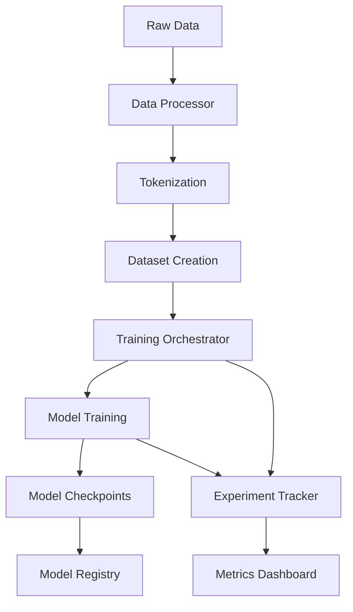
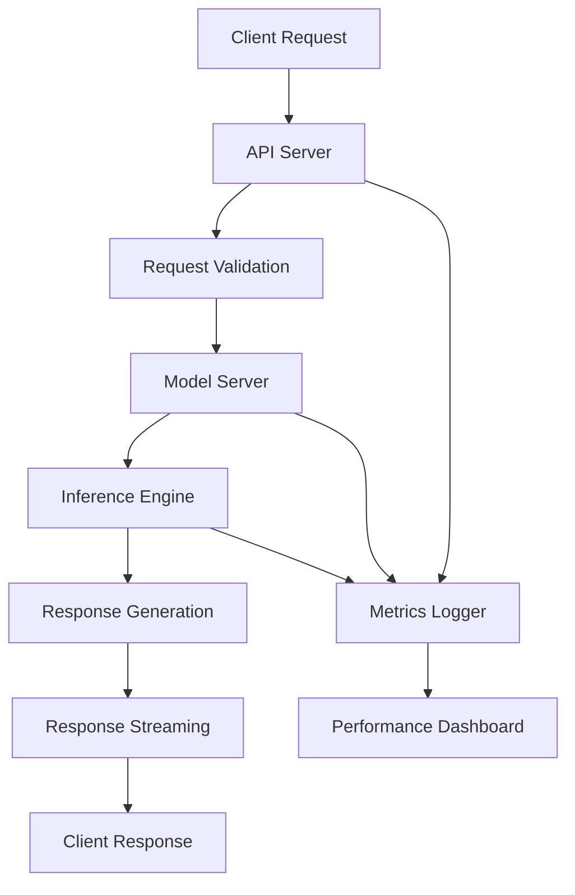

# System Overview

The Custom LLM Chatbot is a comprehensive, production-ready framework designed for training, fine-tuning, and serving Large Language Models (LLMs). This document provides a high-level overview of the system architecture, design principles, and key components.

## 🏗️ Architecture Overview

The system follows a modular, layered architecture that separates concerns and enables scalability:

```
┌─────────────────────────────────────────────────────────────┐
│                    Application Layer                        │
├─────────────────────────────────────────────────────────────┤
│  Streamlit UI  │  FastAPI Server  │  CLI Tools  │  Scripts │
├─────────────────────────────────────────────────────────────┤
│                     Serving Layer                          │
├─────────────────────────────────────────────────────────────┤
│  Model Server  │  vLLM Server  │  ONNX Runtime  │  API Gateway │
├─────────────────────────────────────────────────────────────┤
│                    Training Layer                          │
├─────────────────────────────────────────────────────────────┤
│  Training Orchestrator  │  DPO Trainer  │  LoRA Trainer   │
├─────────────────────────────────────────────────────────────┤
│                      Core Layer                            │
├─────────────────────────────────────────────────────────────┤
│  Model Manager  │  Config Manager  │  Data Processor      │
├─────────────────────────────────────────────────────────────┤
│                   Monitoring Layer                         │
├─────────────────────────────────────────────────────────────┤
│  Experiment Tracker  │  Metrics Logger  │  Performance Monitor │
└─────────────────────────────────────────────────────────────┘
```

## 🎯 Design Principles

### 1. Modularity
- **Separation of Concerns**: Each component has a single, well-defined responsibility
- **Loose Coupling**: Components interact through well-defined interfaces
- **High Cohesion**: Related functionality is grouped together

### 2. Scalability
- **Horizontal Scaling**: Support for distributed training and serving
- **Vertical Scaling**: Efficient resource utilization and optimization
- **Load Balancing**: Built-in request queuing and concurrent processing

### 3. Flexibility
- **Multiple Training Methods**: Support for various training approaches
- **Backend Agnostic**: Multiple serving backends (PyTorch, ONNX, vLLM)
- **Configuration Driven**: YAML-based configuration for all components

### 4. Production Readiness
- **Monitoring**: Comprehensive metrics and experiment tracking
- **Error Handling**: Robust error handling and recovery mechanisms
- **Security**: Best practices for API security and model protection
- **Testing**: Comprehensive test suite with high coverage

## 🔧 Core Components

### Configuration Management
**Location**: `src/core/config.py`

Centralized configuration management using dataclasses and YAML files:

- **ModelConfig**: Model-specific settings (name, type, device, etc.)
- **TrainingConfig**: Training parameters and optimization settings
- **DataConfig**: Data processing and pipeline configuration
- **ServingConfig**: API server and inference settings
- **MonitoringConfig**: Experiment tracking and metrics configuration

**Key Features**:
- Type-safe configuration with validation
- Environment variable override support
- Hierarchical configuration structure
- Runtime configuration updates

### Model Management
**Location**: `src/core/model_manager.py`

Handles model loading, optimization, and lifecycle management:

- **Model Loading**: Support for HuggingFace models and local checkpoints
- **Optimization**: Quantization, ONNX conversion, and memory optimization
- **Device Management**: Automatic device selection and multi-GPU support
- **LoRA Integration**: Parameter-efficient fine-tuning support

**Key Features**:
- Lazy loading for memory efficiency
- Automatic device placement
- Model format conversion (PyTorch ↔ ONNX)
- Memory optimization techniques

## 🎓 Training System

### Training Orchestrator
**Location**: `src/training/trainer.py`

Centralized training coordination supporting multiple training methods:

#### Supported Training Methods

1. **From-Scratch Training**
   - Complete model training from random initialization
   - Custom architecture support (Qwen-based)
   - Distributed training with Accelerate/DeepSpeed

2. **Supervised Fine-Tuning (SFT)**
   - Standard fine-tuning on instruction datasets
   - Task-specific adaptation
   - Efficient gradient accumulation

3. **LoRA Fine-Tuning**
   - Parameter-efficient fine-tuning
   - Configurable rank and target modules
   - Memory-efficient training

4. **DPO Training**
   - Direct Preference Optimization
   - Human preference alignment
   - Reference model management

### DPO Trainer
**Location**: `src/training/dpo_trainer.py`

Specialized trainer for Direct Preference Optimization:

- **Preference Learning**: Learn from human preference data
- **Reference Model**: Maintains frozen reference for stability
- **Custom Loss Function**: Implements DPO loss with configurable beta
- **Batch Processing**: Efficient handling of preference pairs

## 🚀 Serving System

### Model Server
**Location**: `src/serving/model_server.py`

Core inference engine with multiple backend support:

#### Backend Options

1. **PyTorch Backend**
   - Native PyTorch inference
   - Full model feature support
   - Development and debugging friendly

2. **ONNX Runtime Backend**
   - Optimized inference performance
   - Cross-platform compatibility
   - Reduced memory footprint

3. **vLLM Backend**
   - High-throughput serving
   - Advanced batching strategies
   - GPU memory optimization

### API Server
**Location**: `src/serving/api_server.py`

FastAPI-based REST API with comprehensive endpoints:

#### Key Endpoints
- `POST /generate` - Text generation with streaming support
- `GET /health` - Health check and system status
- `GET /stats` - Performance metrics and statistics
- `POST /chat` - Conversational interface
- `GET /models` - Available model information

#### Features
- **Streaming Responses**: Real-time token streaming
- **Request Queuing**: Concurrent request handling
- **Rate Limiting**: Configurable request throttling
- **CORS Support**: Cross-origin resource sharing
- **Authentication**: Token-based API security

## 📊 Monitoring System

### Experiment Tracking
**Location**: `src/monitoring/experiment_tracker.py`

Unified experiment tracking across multiple platforms:

#### Supported Platforms
- **Weights & Biases (wandb)**: Comprehensive experiment tracking
- **Comet ML**: Advanced experiment management
- **MLflow**: Open-source ML lifecycle management
- **TensorBoard**: Training visualization

#### Tracked Metrics
- **Training Metrics**: Loss, perplexity, learning rate
- **Evaluation Metrics**: BLEU, ROUGE, custom metrics
- **System Metrics**: GPU utilization, memory usage
- **Performance Metrics**: Inference latency, throughput

### Metrics Logger
**Location**: `src/monitoring/metrics_logger.py`

Real-time metrics collection and logging:

- **Performance Monitoring**: Request latency, throughput
- **Resource Monitoring**: CPU, GPU, memory usage
- **Error Tracking**: Exception logging and analysis
- **Custom Metrics**: Application-specific measurements

## 🔄 Data Flow

### Training Data Flow


### Serving Data Flow


## 🛠️ Technology Stack

### Core ML Framework
- **PyTorch**: Primary deep learning framework
- **Transformers**: HuggingFace model library
- **Accelerate**: Distributed training support
- **PEFT**: Parameter-efficient fine-tuning

### Serving Infrastructure
- **FastAPI**: Modern web framework for APIs
- **Uvicorn**: ASGI server for production
- **vLLM**: High-performance inference engine
- **ONNX Runtime**: Cross-platform inference

### Data Processing
- **Datasets**: HuggingFace datasets library
- **Pandas**: Data manipulation and analysis
- **NumPy**: Numerical computing

### Monitoring & Tracking
- **Weights & Biases**: Experiment tracking
- **Comet ML**: ML experiment management
- **MLflow**: ML lifecycle management
- **Prometheus**: Metrics collection

### Development Tools
- **pytest**: Testing framework
- **Black**: Code formatting
- **MyPy**: Static type checking
- **Pre-commit**: Git hooks for code quality

## 🔐 Security Considerations

### API Security
- **Authentication**: Token-based API access
- **Rate Limiting**: Request throttling and abuse prevention
- **Input Validation**: Comprehensive request validation
- **CORS Configuration**: Secure cross-origin requests

### Model Security
- **Model Encryption**: Encrypted model storage
- **Access Control**: Role-based model access
- **Audit Logging**: Comprehensive access logging
- **Secure Deployment**: Container security best practices

## 📈 Performance Characteristics

### Training Performance
- **Multi-GPU Support**: Distributed training across multiple GPUs
- **Memory Optimization**: Gradient checkpointing and mixed precision
- **Efficient Data Loading**: Optimized data pipeline with caching
- **Dynamic Batching**: Adaptive batch sizing for optimal throughput

### Serving Performance
- **High Throughput**: vLLM backend for production workloads
- **Low Latency**: Optimized inference pipelines
- **Concurrent Processing**: Asynchronous request handling
- **Resource Efficiency**: Memory and compute optimization

## 🔮 Extensibility

The system is designed for easy extension and customization:

### Adding New Training Methods
1. Implement trainer interface in `src/training/`
2. Register in training orchestrator
3. Add configuration options
4. Update documentation

### Adding New Serving Backends
1. Implement server interface in `src/serving/`
2. Add backend selection logic
3. Update API server integration
4. Add performance monitoring

### Custom Metrics and Monitoring
1. Extend metrics logger in `src/monitoring/`
2. Add custom metric collection
3. Integrate with experiment tracking
4. Create visualization dashboards

This modular architecture ensures that the system can evolve with changing requirements while maintaining stability and performance.