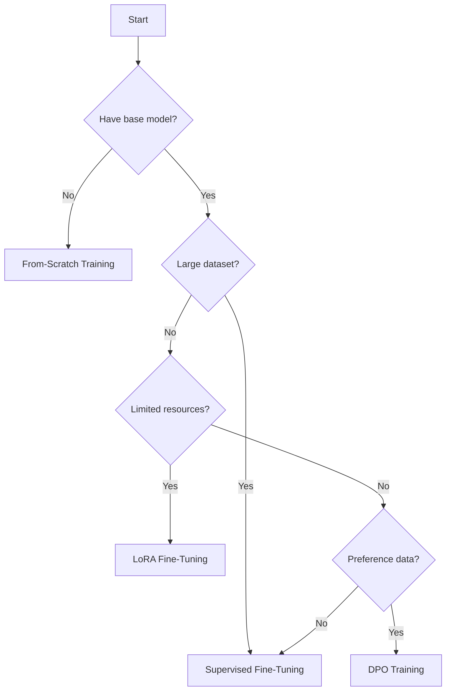
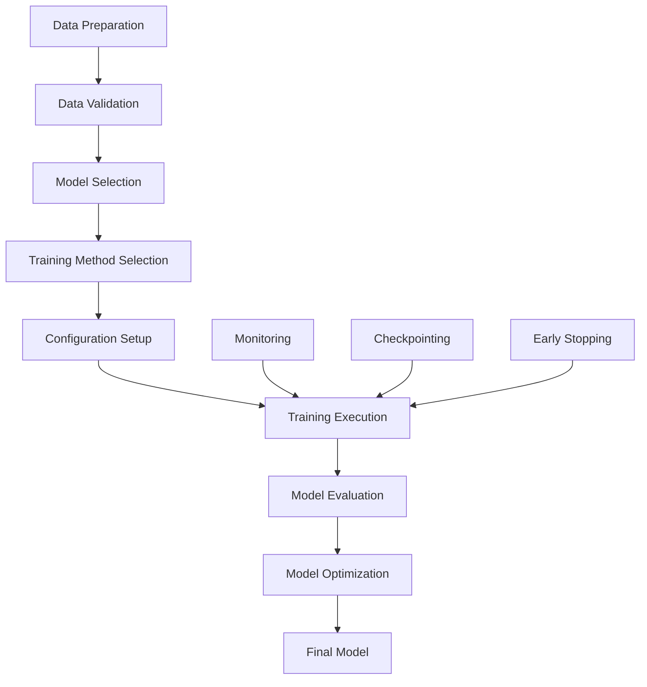

# Training Methods Guide

Comprehensive guide to different training approaches available in the Custom LLM Chatbot system.

## 📋 Table of Contents

- [Overview](#overview)
- [From-Scratch Training](#from-scratch-training)
- [Supervised Fine-Tuning (SFT)](#supervised-fine-tuning-sft)
- [LoRA Fine-Tuning](#lora-fine-tuning)
- [Direct Preference Optimization (DPO)](#direct-preference-optimization-dpo)
- [Training Pipeline](#training-pipeline)
- [Performance Optimization](#performance-optimization)
- [Monitoring and Evaluation](#monitoring-and-evaluation)
- [Best Practices](#best-practices)
- [Troubleshooting](#troubleshooting)

## 🔍 Overview

The Custom LLM Chatbot supports four main training methods, each designed for different use cases and resource constraints:

| Method | Use Case | Resources | Training Time | Model Quality |
|--------|----------|-----------|---------------|---------------|
| **From-Scratch** | New domain/language | Very High | Very Long | Highest |
| **Supervised Fine-Tuning** | Task adaptation | High | Long | High |
| **LoRA Fine-Tuning** | Efficient adaptation | Medium | Medium | Good |
| **DPO Training** | Preference alignment | Medium | Short | Specialized |

### Training Method Selection



## 🏗️ From-Scratch Training

Training a language model from scratch using raw text data.

### When to Use

- **New Domain**: Creating models for specialized domains (medical, legal, scientific)
- **New Language**: Training models for underrepresented languages
- **Custom Architecture**: Implementing novel model architectures
- **Full Control**: Need complete control over training process

### Configuration

```yaml
# config/from_scratch.yaml
model:
  name: "custom-model"  # Will be created from scratch
  model_type: "qwen"
  vocab_size: 32000
  hidden_size: 2048
  num_hidden_layers: 24
  num_attention_heads: 16
  intermediate_size: 8192
  max_position_embeddings: 2048

training:
  training_type: "from_scratch"
  output_dir: "./models/from_scratch"
  
  from_scratch:
    # Training parameters
    num_train_epochs: 3
    per_device_train_batch_size: 4
    per_device_eval_batch_size: 4
    gradient_accumulation_steps: 16
    
    # Optimization
    learning_rate: 1e-4
    weight_decay: 0.01
    warmup_steps: 10000
    max_grad_norm: 1.0
    
    # Scheduler
    lr_scheduler_type: "cosine"
    warmup_ratio: 0.1
    
    # Mixed precision
    fp16: false
    bf16: true
    
    # Memory optimization
    gradient_checkpointing: true
    dataloader_num_workers: 4
    
    # Evaluation and saving
    eval_strategy: "steps"
    eval_steps: 1000
    save_strategy: "steps"
    save_steps: 5000
    save_total_limit: 3
    load_best_model_at_end: true
    metric_for_best_model: "eval_loss"
    greater_is_better: false
    
    # Logging
    logging_steps: 100
    report_to: ["wandb", "tensorboard"]

data:
  train_data_path: "./data/pretrain/train"
  eval_data_path: "./data/pretrain/eval"
  max_length: 2048
  mlm_probability: 0.15  # For masked language modeling
```

### Data Format

For from-scratch training, use raw text data:

```json
{"text": "This is a sample document for pre-training. It contains natural language text that will be used to train the model from scratch."}
{"text": "Another document with different content. The model will learn language patterns from this diverse text corpus."}
```

### Training Script

```python
# train_from_scratch.py
from src.training.trainer import TrainingOrchestrator
from src.core.config import ConfigManager

def main():
    # Load configuration
    config = ConfigManager("config/from_scratch.yaml")
    
    # Initialize trainer
    trainer = TrainingOrchestrator(config)
    
    # Start training
    trainer.train()
    
    # Evaluate final model
    results = trainer.evaluate()
    print(f"Final evaluation results: {results}")

if __name__ == "__main__":
    main()
```

### Expected Timeline

- **Small Model (1B params)**: 1-2 weeks on 8x A100
- **Medium Model (3B params)**: 2-4 weeks on 8x A100
- **Large Model (7B params)**: 4-8 weeks on 8x A100

## 🎯 Supervised Fine-Tuning (SFT)

Fine-tuning a pre-trained model on task-specific data.

### When to Use

- **Task Adaptation**: Adapting general models to specific tasks
- **Domain Specialization**: Improving performance on domain-specific tasks
- **Instruction Following**: Teaching models to follow instructions
- **Quality Improvement**: Enhancing model responses

### Configuration

```yaml
# config/sft.yaml
model:
  name: "Qwen/Qwen2.5-3B"
  device: "auto"
  torch_dtype: "bfloat16"

training:
  training_type: "sft"
  output_dir: "./models/sft_trained"
  
  sft:
    # Basic parameters
    num_train_epochs: 3
    per_device_train_batch_size: 8
    per_device_eval_batch_size: 8
    gradient_accumulation_steps: 2
    
    # Optimization
    learning_rate: 2e-5
    warmup_ratio: 0.1
    lr_scheduler_type: "cosine"
    weight_decay: 0.01
    
    # Data handling
    max_seq_length: 2048
    packing: false
    dataset_text_field: "text"
    
    # Advanced settings
    fp16: false
    bf16: true
    gradient_checkpointing: true
    remove_unused_columns: false
    
    # Evaluation
    eval_strategy: "steps"
    eval_steps: 500
    save_strategy: "steps"
    save_steps: 1000
    logging_steps: 10
    
    # Early stopping
    load_best_model_at_end: true
    metric_for_best_model: "eval_loss"
    greater_is_better: false
    early_stopping_patience: 3

data:
  train_data_path: "./data/sft/train.jsonl"
  eval_data_path: "./data/sft/eval.jsonl"
  max_length: 2048
```

### Data Format

SFT supports multiple data formats:

#### Chat Format
```json
{
  "messages": [
    {"role": "system", "content": "You are a helpful assistant."},
    {"role": "user", "content": "Explain quantum computing."},
    {"role": "assistant", "content": "Quantum computing is a type of computation that harnesses quantum mechanics..."}
  ]
}
```

#### Instruction Format
```json
{
  "instruction": "Summarize the following text:",
  "input": "Long text to be summarized...",
  "output": "Brief summary of the text."
}
```

### Training Script

```python
# train_sft.py
from src.training.trainer import TrainingOrchestrator
from src.core.config import ConfigManager
from src.data.processor import DataProcessor

def main():
    # Load configuration
    config = ConfigManager("config/sft.yaml")
    
    # Process data if needed
    processor = DataProcessor(config)
    train_dataset = processor.load_dataset(config.data.train_data_path)
    eval_dataset = processor.load_dataset(config.data.eval_data_path)
    
    # Initialize trainer
    trainer = TrainingOrchestrator(config)
    
    # Start training
    trainer.train()
    
    # Save final model
    trainer.save_model("./models/sft_final")

if __name__ == "__main__":
    main()
```

### Expected Timeline

- **Small Dataset (1K samples)**: 1-2 hours on single A100
- **Medium Dataset (10K samples)**: 4-8 hours on single A100
- **Large Dataset (100K samples)**: 1-2 days on single A100

## 🔧 LoRA Fine-Tuning

Parameter-efficient fine-tuning using Low-Rank Adaptation.

### When to Use

- **Limited Resources**: GPU memory or compute constraints
- **Multiple Tasks**: Need to train multiple task-specific adapters
- **Quick Experimentation**: Rapid prototyping and testing
- **Model Serving**: Easy switching between different adapters

### Configuration

```yaml
# config/lora.yaml
model:
  name: "Qwen/Qwen2.5-7B"
  device: "auto"
  torch_dtype: "bfloat16"

training:
  training_type: "lora"
  output_dir: "./models/lora_trained"
  
  lora:
    enabled: true
    
    # LoRA parameters
    r: 16                    # LoRA rank (higher = more parameters)
    lora_alpha: 32           # LoRA scaling parameter
    lora_dropout: 0.1        # LoRA dropout rate
    
    # Target modules (model-specific)
    target_modules:
      - "q_proj"             # Query projection
      - "v_proj"             # Value projection
      - "k_proj"             # Key projection
      - "o_proj"             # Output projection
      - "gate_proj"          # Gate projection (for some models)
      - "up_proj"            # Up projection
      - "down_proj"          # Down projection
    
    # Advanced LoRA settings
    bias: "none"             # Bias handling: none, all, lora_only
    task_type: "CAUSAL_LM"   # Task type
    inference_mode: false    # Inference mode
    
    # Training parameters
    num_train_epochs: 5
    per_device_train_batch_size: 8
    gradient_accumulation_steps: 4
    learning_rate: 1e-4
    warmup_steps: 100
    weight_decay: 0.01
    
    # Optimization
    optimizer: "adamw_torch"
    lr_scheduler_type: "cosine"
    max_grad_norm: 1.0
    
    # Mixed precision
    fp16: false
    bf16: true
    gradient_checkpointing: true
    
    # Evaluation
    eval_strategy: "steps"
    eval_steps: 200
    save_strategy: "steps"
    save_steps: 500
    logging_steps: 10

data:
  train_data_path: "./data/lora/train.jsonl"
  eval_data_path: "./data/lora/eval.jsonl"
  max_length: 2048
```

### LoRA Parameter Selection

| Parameter | Small Model | Medium Model | Large Model |
|-----------|-------------|--------------|-------------|
| **r** | 8-16 | 16-32 | 32-64 |
| **lora_alpha** | 16-32 | 32-64 | 64-128 |
| **lora_dropout** | 0.05-0.1 | 0.1 | 0.1-0.2 |

### Training Script

```python
# train_lora.py
from src.training.trainer import TrainingOrchestrator
from src.core.config import ConfigManager
from peft import get_peft_model, LoraConfig

def main():
    # Load configuration
    config = ConfigManager("config/lora.yaml")
    
    # Initialize trainer with LoRA
    trainer = TrainingOrchestrator(config)
    
    # Start training
    trainer.train()
    
    # Save LoRA adapter
    trainer.save_adapter("./models/lora_adapter")
    
    # Merge and save full model (optional)
    trainer.merge_and_save("./models/lora_merged")

if __name__ == "__main__":
    main()
```

### Loading LoRA Models

```python
# Load LoRA adapter
from peft import PeftModel
from transformers import AutoModelForCausalLM, AutoTokenizer

# Load base model
base_model = AutoModelForCausalLM.from_pretrained("Qwen/Qwen2.5-7B")
tokenizer = AutoTokenizer.from_pretrained("Qwen/Qwen2.5-7B")

# Load LoRA adapter
model = PeftModel.from_pretrained(base_model, "./models/lora_adapter")

# Use for inference
inputs = tokenizer("Hello, how are you?", return_tensors="pt")
outputs = model.generate(**inputs, max_length=100)
response = tokenizer.decode(outputs[0], skip_special_tokens=True)
print(response)
```

### Expected Timeline

- **Small Dataset (1K samples)**: 30 minutes on single A100
- **Medium Dataset (10K samples)**: 2-4 hours on single A100
- **Large Dataset (100K samples)**: 8-12 hours on single A100

## 🎯 Direct Preference Optimization (DPO)

Training models to align with human preferences using preference pairs.

### When to Use

- **Preference Alignment**: Align model outputs with human preferences
- **Safety Training**: Reduce harmful or inappropriate outputs
- **Quality Improvement**: Improve response quality and helpfulness
- **RLHF Alternative**: Simpler alternative to reinforcement learning

### Configuration

```yaml
# config/dpo.yaml
model:
  name: "Qwen/Qwen2.5-3B"
  device: "auto"
  torch_dtype: "bfloat16"

training:
  training_type: "dpo"
  output_dir: "./models/dpo_trained"
  
  dpo:
    # DPO-specific parameters
    num_train_epochs: 1
    per_device_train_batch_size: 2
    per_device_eval_batch_size: 2
    gradient_accumulation_steps: 16
    
    # DPO hyperparameters
    learning_rate: 1e-6
    beta: 0.1                    # DPO temperature parameter
    max_length: 1024             # Maximum sequence length
    max_prompt_length: 512       # Maximum prompt length
    
    # Reference model settings
    reference_model: null        # Use base model as reference
    reference_model_path: null   # Path to custom reference model
    
    # Loss configuration
    loss_type: "sigmoid"         # Loss function type
    label_smoothing: 0.0         # Label smoothing factor
    
    # Optimization
    optimizer: "adamw_torch"
    lr_scheduler_type: "cosine"
    warmup_steps: 100
    weight_decay: 0.01
    max_grad_norm: 1.0
    
    # Mixed precision
    fp16: false
    bf16: true
    gradient_checkpointing: true
    
    # Evaluation
    eval_strategy: "steps"
    eval_steps: 100
    save_strategy: "steps"
    save_steps: 500
    logging_steps: 10
    
    # Data handling
    remove_unused_columns: false
    dataloader_num_workers: 4

data:
  train_data_path: "./data/dpo/train.jsonl"
  eval_data_path: "./data/dpo/eval.jsonl"
  max_length: 1024
```

### Data Format

DPO requires preference pairs:

```json
{
  "prompt": "What is the capital of France?",
  "chosen": "The capital of France is Paris, which is located in the north-central part of the country and serves as the political, economic, and cultural center.",
  "rejected": "I think it might be Lyon or maybe Marseille, but I'm not completely sure about this.",
  "metadata": {
    "preference_strength": 0.9,
    "annotator_id": "annotator_001",
    "task_category": "factual_qa"
  }
}
```

### Training Script

```python
# train_dpo.py
from src.training.dpo_trainer import DPOTrainer
from src.core.config import ConfigManager
from src.data.processor import DataProcessor

def main():
    # Load configuration
    config = ConfigManager("config/dpo.yaml")
    
    # Process DPO data
    processor = DataProcessor(config)
    train_dataset = processor.load_dpo_dataset(config.data.train_data_path)
    eval_dataset = processor.load_dpo_dataset(config.data.eval_data_path)
    
    # Initialize DPO trainer
    trainer = DPOTrainer(config)
    
    # Start training
    trainer.train(train_dataset, eval_dataset)
    
    # Save trained model
    trainer.save_model("./models/dpo_final")

if __name__ == "__main__":
    main()
```

### DPO Loss Function

The DPO loss is computed as:

```
L_DPO = -log(σ(β * log(π_θ(y_w|x)/π_ref(y_w|x)) - β * log(π_θ(y_l|x)/π_ref(y_l|x))))
```

Where:
- `π_θ` is the policy model
- `π_ref` is the reference model
- `y_w` is the chosen response
- `y_l` is the rejected response
- `β` is the temperature parameter
- `σ` is the sigmoid function

### Expected Timeline

- **Small Dataset (1K pairs)**: 1-2 hours on single A100
- **Medium Dataset (10K pairs)**: 4-6 hours on single A100
- **Large Dataset (100K pairs)**: 12-24 hours on single A100

## 🔄 Training Pipeline

### Complete Training Workflow



### Training Orchestrator

```python
# src/training/orchestrator.py
class TrainingOrchestrator:
    def __init__(self, config):
        self.config = config
        self.model_manager = ModelManager(config)
        self.data_processor = DataProcessor(config)
        self.experiment_tracker = ExperimentTracker(config)
        
    def train(self):
        # 1. Setup experiment tracking
        self.experiment_tracker.start_experiment()
        
        # 2. Load and prepare data
        train_dataset, eval_dataset = self.prepare_data()
        
        # 3. Initialize model
        model, tokenizer = self.model_manager.load_model()
        
        # 4. Setup training
        trainer = self.setup_trainer(model, tokenizer, train_dataset, eval_dataset)
        
        # 5. Start training
        training_result = trainer.train()
        
        # 6. Evaluate model
        eval_result = trainer.evaluate()
        
        # 7. Log results
        self.experiment_tracker.log_results({
            'training_result': training_result,
            'eval_result': eval_result
        })
        
        # 8. Save model
        self.save_model(trainer.model)
        
        return training_result
    
    def setup_trainer(self, model, tokenizer, train_dataset, eval_dataset):
        training_type = self.config.training.training_type
        
        if training_type == "from_scratch":
            return self.setup_from_scratch_trainer(model, tokenizer, train_dataset, eval_dataset)
        elif training_type == "sft":
            return self.setup_sft_trainer(model, tokenizer, train_dataset, eval_dataset)
        elif training_type == "lora":
            return self.setup_lora_trainer(model, tokenizer, train_dataset, eval_dataset)
        elif training_type == "dpo":
            return self.setup_dpo_trainer(model, tokenizer, train_dataset, eval_dataset)
        else:
            raise ValueError(f"Unknown training type: {training_type}")
```

### Multi-Stage Training

```python
# Multi-stage training pipeline
class MultiStageTrainer:
    def __init__(self, config):
        self.config = config
        self.stages = config.training.stages
        
    def train(self):
        model_path = self.config.model.name
        
        for stage_name, stage_config in self.stages.items():
            print(f"Starting stage: {stage_name}")
            
            # Update config for this stage
            stage_config.model.name = model_path
            
            # Train for this stage
            trainer = TrainingOrchestrator(stage_config)
            result = trainer.train()
            
            # Update model path for next stage
            model_path = stage_config.training.output_dir
            
            print(f"Completed stage: {stage_name}")
            
        return model_path

# Example multi-stage configuration
stages:
  stage1_sft:
    training:
      training_type: "sft"
      num_train_epochs: 3
      output_dir: "./models/stage1_sft"
    data:
      train_data_path: "./data/sft/train.jsonl"
      
  stage2_dpo:
    training:
      training_type: "dpo"
      num_train_epochs: 1
      output_dir: "./models/stage2_dpo"
    data:
      train_data_path: "./data/dpo/train.jsonl"
```

## ⚡ Performance Optimization

### Memory Optimization

```yaml
# Memory-efficient training configuration
training:
  # Gradient checkpointing
  gradient_checkpointing: true
  
  # Mixed precision
  bf16: true
  fp16: false
  
  # Batch size optimization
  per_device_train_batch_size: 1
  gradient_accumulation_steps: 32
  
  # Data loading
  dataloader_num_workers: 2
  dataloader_pin_memory: false
  
  # Model optimization
  torch_compile: true
  torch_compile_backend: "inductor"
```

### Speed Optimization

```python
# Optimized training setup
from torch.distributed import init_process_group
from accelerate import Accelerator

def setup_distributed_training():
    # Initialize distributed training
    accelerator = Accelerator(
        gradient_accumulation_steps=8,
        mixed_precision="bf16",
        log_with="wandb"
    )
    
    return accelerator

def optimize_model(model):
    # Apply optimizations
    if hasattr(torch, 'compile'):
        model = torch.compile(model, mode="reduce-overhead")
    
    # Enable Flash Attention if available
    if hasattr(model.config, 'use_flash_attention_2'):
        model.config.use_flash_attention_2 = True
    
    return model
```

### Multi-GPU Training

```bash
# Single node, multiple GPUs
torchrun --nproc_per_node=4 train.py --config config/distributed.yaml

# Multiple nodes
torchrun --nnodes=2 --nproc_per_node=4 --master_addr="192.168.1.1" --master_port=12345 train.py
```

## 📊 Monitoring and Evaluation

### Training Metrics

```python
# Custom metrics for different training types
class TrainingMetrics:
    def __init__(self, training_type):
        self.training_type = training_type
        self.metrics = self.get_metrics_for_type()
    
    def get_metrics_for_type(self):
        if self.training_type == "from_scratch":
            return {
                'perplexity': self.calculate_perplexity,
                'loss': self.calculate_loss,
                'learning_rate': self.get_learning_rate,
                'tokens_per_second': self.calculate_throughput
            }
        elif self.training_type == "sft":
            return {
                'loss': self.calculate_loss,
                'accuracy': self.calculate_accuracy,
                'bleu_score': self.calculate_bleu,
                'rouge_score': self.calculate_rouge
            }
        elif self.training_type == "dpo":
            return {
                'dpo_loss': self.calculate_dpo_loss,
                'preference_accuracy': self.calculate_preference_accuracy,
                'reward_margin': self.calculate_reward_margin
            }
        # Add more metrics as needed
```

### Evaluation Pipeline

```python
# Comprehensive evaluation
class ModelEvaluator:
    def __init__(self, model, tokenizer, config):
        self.model = model
        self.tokenizer = tokenizer
        self.config = config
        
    def evaluate_comprehensive(self, eval_datasets):
        results = {}
        
        # Standard metrics
        results['perplexity'] = self.calculate_perplexity(eval_datasets['general'])
        results['loss'] = self.calculate_loss(eval_datasets['general'])
        
        # Task-specific evaluation
        if 'qa' in eval_datasets:
            results['qa_accuracy'] = self.evaluate_qa(eval_datasets['qa'])
            
        if 'summarization' in eval_datasets:
            results['rouge_scores'] = self.evaluate_summarization(eval_datasets['summarization'])
            
        if 'translation' in eval_datasets:
            results['bleu_scores'] = self.evaluate_translation(eval_datasets['translation'])
        
        # Safety evaluation
        if 'safety' in eval_datasets:
            results['safety_scores'] = self.evaluate_safety(eval_datasets['safety'])
        
        return results
```

## ✅ Best Practices

### Training Strategy

1. **Start Small**: Begin with smaller models and datasets
2. **Incremental Training**: Use multi-stage training for complex tasks
3. **Regular Evaluation**: Evaluate frequently during training
4. **Checkpoint Management**: Save checkpoints regularly
5. **Experiment Tracking**: Log all experiments and hyperparameters

### Hyperparameter Tuning

```python
# Hyperparameter search
from optuna import create_study

def objective(trial):
    # Suggest hyperparameters
    learning_rate = trial.suggest_float('learning_rate', 1e-6, 1e-3, log=True)
    batch_size = trial.suggest_categorical('batch_size', [2, 4, 8, 16])
    warmup_steps = trial.suggest_int('warmup_steps', 50, 500)
    
    # Update config
    config.training.learning_rate = learning_rate
    config.training.per_device_train_batch_size = batch_size
    config.training.warmup_steps = warmup_steps
    
    # Train model
    trainer = TrainingOrchestrator(config)
    result = trainer.train()
    
    # Return metric to optimize
    return result.eval_loss

# Run optimization
study = create_study(direction='minimize')
study.optimize(objective, n_trials=20)

print(f"Best parameters: {study.best_params}")
print(f"Best value: {study.best_value}")
```

### Data Management

```python
# Data versioning and management
class DataManager:
    def __init__(self, config):
        self.config = config
        self.data_version = self.get_data_version()
        
    def prepare_training_data(self):
        # Load and validate data
        train_data = self.load_and_validate(self.config.data.train_data_path)
        eval_data = self.load_and_validate(self.config.data.eval_data_path)
        
        # Apply preprocessing
        train_data = self.preprocess(train_data)
        eval_data = self.preprocess(eval_data)
        
        # Cache processed data
        self.cache_data(train_data, f"train_v{self.data_version}")
        self.cache_data(eval_data, f"eval_v{self.data_version}")
        
        return train_data, eval_data
```

## 🔧 Troubleshooting

### Common Issues

#### 1. Out of Memory (OOM)

```python
# OOM prevention strategies
def handle_oom():
    # Reduce batch size
    config.training.per_device_train_batch_size = 1
    config.training.gradient_accumulation_steps *= 2
    
    # Enable gradient checkpointing
    config.training.gradient_checkpointing = True
    
    # Use mixed precision
    config.training.bf16 = True
    
    # Reduce sequence length
    config.data.max_length = min(config.data.max_length, 1024)
```

#### 2. Training Instability

```python
# Stability improvements
def improve_stability():
    # Reduce learning rate
    config.training.learning_rate *= 0.5
    
    # Add warmup
    config.training.warmup_steps = max(config.training.warmup_steps, 100)
    
    # Enable gradient clipping
    config.training.max_grad_norm = 1.0
    
    # Use weight decay
    config.training.weight_decay = 0.01
```

#### 3. Slow Training

```python
# Performance improvements
def improve_performance():
    # Optimize data loading
    config.training.dataloader_num_workers = min(8, os.cpu_count())
    config.training.dataloader_pin_memory = True
    
    # Enable compilation
    config.training.torch_compile = True
    
    # Use efficient attention
    config.model.use_flash_attention_2 = True
    
    # Optimize batch size
    config.training.per_device_train_batch_size = find_optimal_batch_size()
```

### Debugging Tools

```python
# Training debugger
class TrainingDebugger:
    def __init__(self, trainer):
        self.trainer = trainer
        
    def debug_training(self):
        # Check model gradients
        self.check_gradients()
        
        # Monitor memory usage
        self.monitor_memory()
        
        # Validate data
        self.validate_data()
        
        # Check learning rate schedule
        self.check_lr_schedule()
    
    def check_gradients(self):
        for name, param in self.trainer.model.named_parameters():
            if param.grad is not None:
                grad_norm = param.grad.norm().item()
                if grad_norm > 10.0:
                    print(f"Large gradient in {name}: {grad_norm}")
                elif grad_norm < 1e-8:
                    print(f"Small gradient in {name}: {grad_norm}")
```

---

**Next Steps**: After training your model, proceed to [Model Optimization](./model-optimization.md) to improve performance and efficiency.