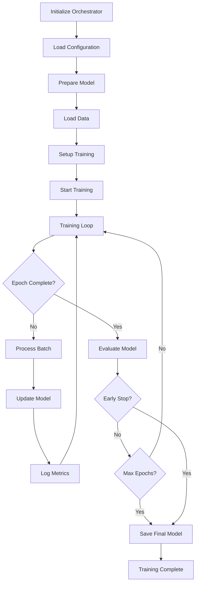
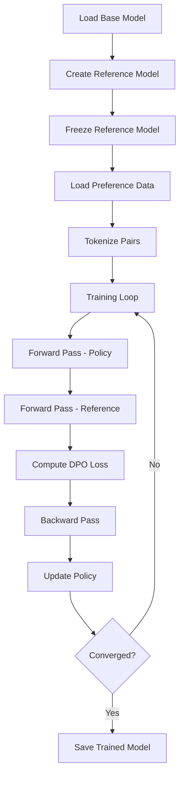

# Training System Documentation

The training system provides comprehensive support for multiple training methodologies, from training models from scratch to advanced fine-tuning techniques like DPO (Direct Preference Optimization) and LoRA (Low-Rank Adaptation).

## 📁 Training Components

| Component | File | Purpose |
|-----------|------|----------|
| **Training Orchestrator** | `trainer.py` | Central coordination of all training processes |
| **DPO Trainer** | `dpo_trainer.py` | Direct Preference Optimization implementation |
| **Metrics Calculator** | `metrics.py` | Training and evaluation metrics computation |

## 🎯 Training Methods Overview

The system supports four primary training approaches:

### 1. From-Scratch Training
**Purpose**: Train a complete model from random initialization
**Use Cases**: 
- Custom architectures
- Domain-specific models
- Full control over training process

**Configuration**:
```yaml
training:
  training_type: "from_scratch"
  from_scratch:
    num_train_epochs: 3
    per_device_train_batch_size: 4
    per_device_eval_batch_size: 4
    gradient_accumulation_steps: 8
    learning_rate: 5e-5
    weight_decay: 0.01
    warmup_steps: 500
    max_grad_norm: 1.0
```

### 2. Supervised Fine-Tuning (SFT)
**Purpose**: Fine-tune pre-trained models on specific tasks
**Use Cases**:
- Task adaptation
- Domain specialization
- Instruction following

**Configuration**:
```yaml
training:
  training_type: "sft"
  sft:
    num_train_epochs: 3
    per_device_train_batch_size: 8
    learning_rate: 2e-5
    warmup_ratio: 0.1
    lr_scheduler_type: "cosine"
```

### 3. LoRA Fine-Tuning
**Purpose**: Parameter-efficient fine-tuning using Low-Rank Adaptation
**Use Cases**:
- Limited computational resources
- Multiple task adaptation
- Quick experimentation

**Configuration**:
```yaml
training:
  training_type: "lora"
  lora:
    enabled: true
    r: 16
    lora_alpha: 32
    lora_dropout: 0.1
    target_modules: ["q_proj", "v_proj", "k_proj", "o_proj"]
    bias: "none"
    task_type: "CAUSAL_LM"
```

### 4. DPO Training
**Purpose**: Align models with human preferences using Direct Preference Optimization
**Use Cases**:
- Human preference alignment
- Safety and helpfulness improvement
- Reducing harmful outputs

**Configuration**:
```yaml
training:
  training_type: "dpo"
  dpo:
    num_train_epochs: 1
    per_device_train_batch_size: 2
    per_device_eval_batch_size: 2
    gradient_accumulation_steps: 16
    learning_rate: 1e-6
    beta: 0.1
    max_length: 1024
    max_prompt_length: 512
```

## 🎼 Training Orchestrator

### Overview
The Training Orchestrator (`trainer.py`) serves as the central coordinator for all training processes, managing the entire training lifecycle from data preparation to model evaluation.

### Key Features
- **Multi-Method Support**: Seamless switching between training methods
- **Experiment Tracking**: Integrated monitoring and logging
- **Distributed Training**: Multi-GPU and multi-node support
- **Checkpointing**: Automatic model saving and recovery
- **Early Stopping**: Configurable early stopping criteria

### Training Lifecycle



### Usage Example

```python
from src.core.config import ConfigManager
from src.training.trainer import TrainingOrchestrator

# Initialize components
config = ConfigManager()
config.load_config("config.yaml")

trainer = TrainingOrchestrator(config)

# Prepare for training
success = trainer.prepare_training(
    training_type="dpo",
    model_name="Qwen/Qwen2.5-3B"
)

if success:
    # Load training data
    train_dataset = trainer.load_training_data("./data/train")
    eval_dataset = trainer.load_evaluation_data("./data/eval")
    
    # Start training
    results = trainer.train(
        train_dataset=train_dataset,
        eval_dataset=eval_dataset
    )
    
    print(f"Training completed. Final loss: {results['final_loss']:.4f}")
    print(f"Best model saved to: {results['best_model_path']}")
else:
    print("Training preparation failed")
```

## 🎯 DPO Training Deep Dive

### Direct Preference Optimization
DPO is a method for training language models to align with human preferences without requiring reinforcement learning. It directly optimizes the model using preference data.

### DPO Algorithm
The DPO loss function is:

```
L_DPO(π_θ; π_ref) = -E_{(x,y_w,y_l)~D}[log σ(β log π_θ(y_w|x)/π_ref(y_w|x) - β log π_θ(y_l|x)/π_ref(y_l|x))]
```

Where:
- `π_θ`: Policy being trained
- `π_ref`: Reference policy (frozen)
- `y_w`: Preferred response
- `y_l`: Less preferred response
- `β`: Temperature parameter
- `σ`: Sigmoid function

### DPO Data Format
DPO requires preference pairs in the following format:

```json
{
  "prompt": "What is the capital of France?",
  "chosen": "The capital of France is Paris, a beautiful city known for its culture and history.",
  "rejected": "I think it might be Lyon or maybe Marseille, I'm not really sure."
}
```

### DPO Training Process



### DPO Implementation Example

```python
from src.training.dpo_trainer import DPOTrainer
from src.core.model_manager import ModelManager

# Initialize components
model_manager = ModelManager(config)
model_manager.load_model()

dpo_trainer = DPOTrainer(
    model=model_manager.model,
    tokenizer=model_manager.tokenizer,
    config=config
)

# Prepare DPO dataset
dpo_dataset = dpo_trainer.prepare_dataset(preference_data)

# Train with DPO
results = dpo_trainer.train(
    train_dataset=dpo_dataset,
    eval_dataset=eval_dpo_dataset
)

print(f"DPO training completed. Final reward margin: {results['reward_margin']:.4f}")
```

### DPO Metrics
The DPO trainer tracks several key metrics:

- **Reward Margin**: Difference in rewards between chosen and rejected responses
- **Accuracy**: Percentage of times chosen response has higher reward
- **KL Divergence**: Divergence from reference model
- **Loss Components**: Policy loss, reference loss, total loss

## 📊 Training Metrics

### Core Metrics
The system tracks comprehensive metrics during training:

#### Loss Metrics
- **Training Loss**: Primary optimization objective
- **Validation Loss**: Generalization performance
- **Perplexity**: Model uncertainty measure
- **Gradient Norm**: Training stability indicator

#### Performance Metrics
- **BLEU Score**: Text generation quality
- **ROUGE Score**: Summarization quality
- **BERTScore**: Semantic similarity
- **Custom Metrics**: Task-specific evaluations

#### System Metrics
- **GPU Utilization**: Hardware efficiency
- **Memory Usage**: Resource consumption
- **Training Speed**: Tokens per second
- **Throughput**: Samples per second

### Metrics Implementation

```python
from src.training.metrics import MetricsCalculator

# Initialize metrics calculator
metrics_calc = MetricsCalculator(config)

# Compute training metrics
training_metrics = metrics_calc.compute_training_metrics(
    predictions=model_outputs,
    references=ground_truth,
    loss=current_loss
)

# Compute evaluation metrics
eval_metrics = metrics_calc.compute_evaluation_metrics(
    model=model,
    eval_dataset=eval_data,
    tokenizer=tokenizer
)

# Log metrics
metrics_calc.log_metrics({
    **training_metrics,
    **eval_metrics,
    "epoch": current_epoch,
    "step": current_step
})
```

## 🔧 Advanced Training Features

### Distributed Training
Support for multi-GPU and multi-node training:

```python
# Configure distributed training
config.training.distributed = True
config.training.num_gpus = 4
config.training.gradient_accumulation_steps = 8

# Initialize with Accelerate
from accelerate import Accelerator

accelerator = Accelerator(
    gradient_accumulation_steps=config.training.gradient_accumulation_steps,
    mixed_precision="fp16",
    log_with="wandb"
)

# Training orchestrator will automatically use distributed setup
trainer = TrainingOrchestrator(config, accelerator=accelerator)
```

### Memory Optimization
Techniques for training large models with limited memory:

```python
# Enable memory optimizations
config.training.gradient_checkpointing = True
config.training.fp16 = True
config.training.dataloader_pin_memory = True
config.training.dataloader_num_workers = 4

# DeepSpeed integration
config.training.deepspeed = {
    "zero_stage": 2,
    "offload_optimizer": True,
    "offload_param": True
}
```

### Curriculum Learning
Gradual increase in training difficulty:

```python
# Configure curriculum learning
config.training.curriculum = {
    "enabled": True,
    "strategy": "length_based",  # length_based, difficulty_based
    "start_length": 128,
    "end_length": 2048,
    "steps": 1000
}
```

### Custom Training Loops
Implement custom training logic:

```python
class CustomTrainer(TrainingOrchestrator):
    def custom_training_step(self, batch, model, optimizer):
        """Custom training step with additional logic."""
        # Custom preprocessing
        batch = self.preprocess_batch(batch)
        
        # Forward pass
        outputs = model(**batch)
        loss = outputs.loss
        
        # Custom loss modifications
        if self.config.training.use_auxiliary_loss:
            aux_loss = self.compute_auxiliary_loss(outputs)
            loss = loss + 0.1 * aux_loss
        
        # Backward pass
        self.accelerator.backward(loss)
        
        return {"loss": loss.item(), "aux_loss": aux_loss.item()}
```

## 🎛️ Training Configuration Examples

### High-Performance Training
```yaml
training:
  training_type: "from_scratch"
  
  # Optimization settings
  fp16: false
  bf16: true
  gradient_checkpointing: true
  dataloader_num_workers: 8
  dataloader_pin_memory: true
  
  # Distributed settings
  distributed: true
  num_gpus: 8
  gradient_accumulation_steps: 4
  
  # Performance tuning
  max_grad_norm: 1.0
  warmup_ratio: 0.05
  lr_scheduler_type: "cosine_with_restarts"
  
  # Memory optimization
  deepspeed:
    zero_stage: 3
    offload_optimizer: true
    offload_param: true
```

### Memory-Efficient Training
```yaml
training:
  training_type: "lora"
  
  # LoRA settings for efficiency
  lora:
    r: 8  # Lower rank for memory efficiency
    lora_alpha: 16
    target_modules: ["q_proj", "v_proj"]  # Fewer modules
  
  # Memory optimizations
  gradient_checkpointing: true
  fp16: true
  per_device_train_batch_size: 1
  gradient_accumulation_steps: 32
  
  # CPU offloading
  cpu_offload: true
  pin_memory: false
```

### Experimental Training
```yaml
training:
  training_type: "dpo"
  
  # DPO specific settings
  dpo:
    beta: 0.1
    max_length: 512  # Shorter for faster iteration
    reference_free: false
  
  # Quick iteration settings
  num_train_epochs: 1
  eval_steps: 50
  save_steps: 100
  logging_steps: 10
  
  # Experiment tracking
  report_to: ["wandb", "tensorboard"]
  run_name: "dpo_experiment_v1"
```

## 🚀 Training Best Practices

### 1. Data Preparation
- **Quality over Quantity**: Ensure high-quality training data
- **Data Validation**: Validate data format and content
- **Balanced Datasets**: Maintain balanced representation
- **Preprocessing**: Consistent text preprocessing

### 2. Hyperparameter Tuning
- **Learning Rate**: Start with recommended values, tune carefully
- **Batch Size**: Balance memory usage and training stability
- **Gradient Accumulation**: Simulate larger batch sizes
- **Warmup**: Use warmup for training stability

### 3. Monitoring and Debugging
- **Loss Curves**: Monitor training and validation loss
- **Gradient Norms**: Check for gradient explosion/vanishing
- **Memory Usage**: Monitor GPU memory consumption
- **Sample Outputs**: Regularly check model outputs

### 4. Checkpointing Strategy
- **Regular Saves**: Save checkpoints frequently
- **Best Model**: Keep track of best performing model
- **Recovery**: Implement checkpoint recovery
- **Storage**: Manage checkpoint storage efficiently

### 5. Evaluation Strategy
- **Multiple Metrics**: Use diverse evaluation metrics
- **Held-out Data**: Maintain separate test sets
- **Human Evaluation**: Include human assessment
- **Continuous Monitoring**: Monitor model performance over time

This comprehensive training system provides the flexibility and power needed to train state-of-the-art language models while maintaining efficiency and reliability.